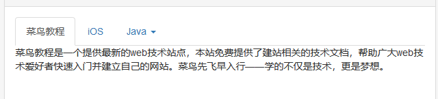

# 模态框 与标签页

```java
<!DOCTYPE html>
<html>
<head>
    <meta charset="utf-8">
    <title>Bootstrap 实例 - 模态框（Modal）插件</title>
    <link rel="stylesheet" href="https://cdn.staticfile.org/twitter-bootstrap/3.3.7/css/bootstrap.min.css">
    <script src="https://cdn.staticfile.org/jquery/2.1.1/jquery.min.js"></script>
    <script src="https://cdn.staticfile.org/twitter-bootstrap/3.3.7/js/bootstrap.min.js"></script>
</head>
<body>

<h2>创建模态框（Modal）</h2>
<!-- 按钮触发模态框 -->
<button class="btn btn-primary btn-lg" data-toggle="modal" data-target="#myModal">
    开始演示模态框
</button>


<!-- 模态框（Modal） -->
<div class="modal fade" id="myModal" tabindex="-1" role="dialog" aria-labelledby="myModalLabel" aria-hidden="true">
    <div class="modal-dialog modal-sm">  //这里修改模态框的大小 modal-sm小号，单独只有这个modal-dialog，正常大小，，modal-lg大号
        <div class="modal-content">
            <div class="modal-header">
                <button type="button" class="close" data-dismiss="modal" aria-hidden="true">
                    &times;
                </button>
                <h4 class="modal-title" id="myModalLabel">
                    模态框（Modal）标题
                </h4>
            </div>
            <div class="modal-body">
                在这里添加一些文本
            </div>
            <div class="modal-footer">
                <button type="button" class="btn btn-default" data-dismiss="modal">关闭
                </button>
                <button type="button" class="btn btn-primary">
                    提交更改
                </button>
            </div>
        </div><!-- /.modal-content -->
    </div>
</div><!-- /.modal -->
</body>
</html>
```

手动显示模态框

```
 $('#myModal').modal('show')
```


手动隐藏模态框

```
 $('#myModal').modal('hide')
```


点击按钮出现模态框并为模态框传值

```java
    /*模态框初始化*/
        $('#myModal').on('show.bs.modal', function (event) {
            var button = $(event.relatedTarget); //触发模态框的按钮
            var id = button.data('id');
            var modal = $(this);
            var commitAuth = modal.find('#commitAuth'); //找到模态框中需要赋值的html标签
            commitAuth.attr("id", id);
        });
        /*end*/

<button type="button" class="btn btn-default" data-toggle="modal"
data-target="#myModal" data-id="12">  回 复 </button>
```

## 模态框里面的提交事件

```ajax
 $('#commitAuth').click(function(){
            var url = $(this).attr('url');
            var message = $(this).parent().prev().children('textarea').val();
            $.ajax({
                type: "GET",
                url: url,
                data :{remark : message},
                dataType: "json",
                success : function(result){
                    window.location.reload();
                },
                error : function(result){
                    window.location.reload();
                }
            });
        });/*end*/

```


## 标签页

```java
<!DOCTYPE html>
<html>
<head>
	<meta charset="utf-8"> 
	<title>Bootstrap 实例 - 标签页（Tab）插件</title>
	<link rel="stylesheet" href="https://cdn.staticfile.org/twitter-bootstrap/3.3.7/css/bootstrap.min.css">
	<script src="https://cdn.staticfile.org/jquery/2.1.1/jquery.min.js"></script>
	<script src="https://cdn.staticfile.org/twitter-bootstrap/3.3.7/js/bootstrap.min.js"></script>
</head>
<body>

<ul id="myTab" class="nav nav-tabs">
	<li class="active">
		<a href="#home" data-toggle="tab">
			 菜鸟教程
		</a>
	</li>
	<li><a href="#ios" data-toggle="tab">iOS</a></li>
	<li class="dropdown">
		<a href="#" id="myTabDrop1" class="dropdown-toggle" 
		   data-toggle="dropdown">Java 
			<b class="caret"></b>
		</a>
		<ul class="dropdown-menu" role="menu" aria-labelledby="myTabDrop1">
			<li><a href="#jmeter" tabindex="-1" data-toggle="tab">jmeter</a></li>
			<li><a href="#ejb" tabindex="-1" data-toggle="tab">ejb</a></li>
		</ul>
	</li>
</ul>
<div id="myTabContent" class="tab-content">
	<div class="tab-pane fade in active" id="home">
		<p>菜鸟教程是一个提供最新的web技术站点，本站免费提供了建站相关的技术文档，帮助广大web技术爱好者快速入门并建立自己的网站。菜鸟先飞早入行——学的不仅是技术，更是梦想。</p>
	</div>
	<div class="tab-pane fade" id="ios">
		<p>iOS 是一个由苹果公司开发和发布的手机操作系统。最初是于 2007 年首次发布 iPhone、iPod Touch 和 Apple 
			TV。iOS 派生自 OS X，它们共享 Darwin 基础。OS X 操作系统是用在苹果电脑上，iOS 是苹果的移动版本。</p>
	</div>
	<div class="tab-pane fade" id="jmeter">
		<p>jMeter 是一款开源的测试软件。它是 100% 纯 Java 应用程序，用于负载和性能测试。</p>
	</div>
	<div class="tab-pane fade" id="ejb">
		<p>Enterprise Java Beans（EJB）是一个创建高度可扩展性和强大企业级应用程序的开发架构，部署在兼容应用程序服务器（比如 JBOSS、Web Logic 等）的 J2EE 上。
		</p>
	</div>
</div>

</body>
</html>
```

效果：



选择初始化那个tap页

```
// 通过名称选取标签页
$('#myTab a[href="#profile"]').tab('show')

// 选取第一个标签页
$('#myTab a:first').tab('show')

// 选取最后一个标签页
$('#myTab a:last').tab('show')

// 选取第三个标签页（从 0 开始索引）
$('#myTab li:eq(2) a').tab('show')
```


## 广告图片上传

```ajax
  /*广告图片上传*/
            $('.divImg').on('change', ':file', function () {
                var formData = new FormData();
                formData.append("file", $(this)[0].files[0]);
                formData.append("fileType", "image");
                $.ajax({
                    type: 'post',
                    url: "${base}/admin/file/upload.jhtml",
                    data: formData,
                    cache: false,
                    processData: false,
                    contentType: false,
                    success: function (result) {
                        var data = JSON.parse(result);
                        $(this).parent().children("[name=picture]").attr("value", data.url);
                        $(this).parent().children("img").attr("src", data.url);
                        $(this).parent().children("img").css("display", "");
                    }.bind(this),
                    error: function (data) {
                        alert(data + "上传失败");
                    }
                });
            });
            /*end*/
```


## 广告类型biao变化

```ajax

            /*广告类型biao变化*/
            $('#type').change(function () {
                var typeValue = $(this).val();
                if (typeValue == 1) {
                    $('#link').show();
                    $('#content').hide();
                    $('#shopId').hide();
                } else if (typeValue == 2) {
                    $('#content').show();
                    $('#link').hide();
                    $('#shopId').hide();
                } else if (typeValue == 3) {
                    $('#shopId').show();
                    $('#link').hide();
                    $('#content').hide();
                }
            });
            /*end*/
```

## 图片基本架子

```ajax
<div class="divImg">
  
  <input type="file" name="file">
  <input type="hidden" name="img" id="img"
  value="">
</div>
```


