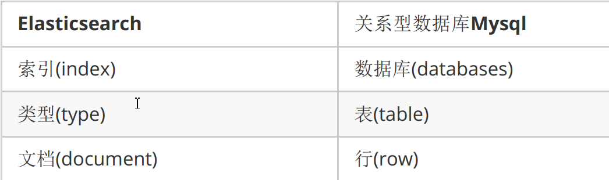
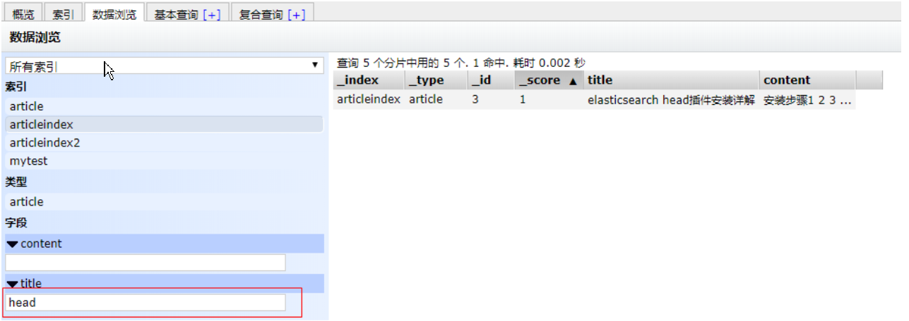

# 分布式搜索引擎ElasticSearch 

## ElasticSearch简介 

### 什么是ElasticSearch 

 Elasticsearch是一个实时的分布式搜索和分析引擎。它可以帮助你用前所未有的速度去处理大规模数据。ElasticSearch是一个基于Lucene的搜索服务器。它提供了一个分布式多用户能力的全文搜索引擎，基于RESTful web接口。Elasticsearch是用Java开发的，并作为Apache许可条款下的开放源码发布，是当前流行的企业级搜索引擎。设计用于云计算中，能够达到实时搜索，稳定，可靠，快速，安装使用方便。 

### ElasticSearch特点 

（1）可以作为一个大型分布式集群（数百台服务器）技术，处理PB级数据，服务大公司；也可以运行在单机上 

（2）将全文检索、数据分析以及分布式技术，合并在了一起，才形成了独一无二的ES； 

（3）开箱即用的，部署简单 

（4）全文检索，同义词处理，相关度排名，复杂数据分析，海量数据的近实时处理 

### ElasticSearch体系结构 



## 走进ElasticSearch 

### ElasticSearch部署与启动 

下载ElasticSearch 5.6.8版本
https://www.elastic.co/downloads/past-releases/elasticsearch-5-6-8 

#### windows下安装

无需安装，解压安装包后即可使用
在命令提示符下，进入ElasticSearch安装目录下的bin目录,执行命令 

```elasticsearch
elasticsearch
```

即可启动。 

我们打开浏览器，在地址栏输入http://127.0.0.1:9200/ 即可看到输出结果 

```elasticsearch
{
"name" : "uV2glMR",
"cluster_name" : "elasticsearch",
"cluster_uuid" : "RdV7UTQZT1‐Jnka9dDPsFg",
"version" : {
"number" : "5.6.8",
"build_hash" : "688ecce",
"build_date" : "2018‐02‐16T16:46:30.010Z",
"build_snapshot" : false,
"lucene_version" : "6.6.1"
},
"tagline" : "You Know, for Search"
}
```

### Postman调用RestAPI 

#### 新建索引 

```elasticsearch
例如我们要创建一个叫articleindex的索引 ,就以put方式提交

http://127.0.0.1:9200/articleindex/
```

#### 新建文档 

```elasticsearch
新建文档：

以post方式提交 http://127.0.0.1:9200/articleindex/article


body:
{
    "title":"SpringBoot2.0",
    "content":"发布啦"
}

返回结果如下：
{
    "_index": "articleindex",
    "_type": "article",
    "_id": "AWPKsdh0FdLZnId5S_F9",
    "_version": 1,
    "result": "created",
    "_shards": {
    "total": 2,
    "successful": 1,
    "failed": 0
    },
    "created": true
}

_id是由系统自动生成的。
```

#### 查询全部文档 

```elasticsearch
查询某索引某类型的全部数据，以get方式请求

http://127.0.0.1:9200/articleindex/article/_search 

返回结果如下：

{
    "took": 5,
    "timed_out": false,
    "_shards": {
    "total": 5,
    "successful": 5,
    "skipped": 0,
    "failed": 0
    },
    "hits": {
    "total": 2,
    "max_score": 1,
    "hits": [
    {
    "_index": "articleindex",
    "_type": "article",
    "_id": "AWPKrI4pFdLZnId5S_F7",
    "_score": 1,
    "_source": {
    "title": "SpringBoot2.0",
    "content": "发布啦"
    }
    },
    {
    "_index": "articleindex",
    "_type": "article",
    "_id": "AWPKsdh0FdLZnId5S_F9",
    "_score": 1,
    "_source": {
    "title": "elasticsearch入门",
    "content": "零基础入门"
    }
    }
    ]
    }
}
```

#### 修改文档 

```java
以put形式提交以下地址：

http://127.0.0.1:9200/articleindex/article/AWPKrI4pFdLZnId5S_F7

body:
{
  "title":"SpringBoot2.0正式版",
  "content":"发布了吗"
}

返回结果：
{
    "_index": "articleindex",
    "_type": "article",
    "_id": "AWPKsdh0FdLZnId5S_F9",
    "_version": 2,
    "result": "updated",
    "_shards": {
    "total": 2,
    "successful": 1,
    "failed": 0
    },
    "created": false
}

如果我们在地址中的ID不存在，则会创建新文档

以put形式提交以下地址：

http://127.0.0.1:9200/articleindex/article/1

body:
{
  "title":"课程好给力",
  "content":"知识点很多"
}

返回信息：
{
  "_index": "articleindex",
  "_type": "article",
  "_id": "1",
  "_version": 1,
  "result": "created",
  "_shards": {
  "total": 2,
  "successful": 1,
  "failed": 0
  },
  "created": true
}

再次查询，看是否有新增的这条文档
```

#### 按ID查询文档 

```elasticsearch
GET方式请求

http://127.0.0.1:9200/articleindex/article/1
```

#### 基本匹配查询 

```elasticsearch
根据某列进行查询 get方式提交下列地址：

http://192.168.184.134:9200/articleindex/article/_search?q=title:课程好给力

以上为按标题查询，返回结果如下：
{
    "took": 10,
    "timed_out": false,
    "_shards": {
    "total": 5,
    "successful": 5,
    "skipped": 0,
    "failed": 0
    },
    "hits": {
    "total": 1,
    "max_score": 2.0649285,
    "hits": [
    {
    "_index": "articleindex",
    "_type": "article",
    "_id": "1",
    "_score": 2.0649285,
    "_source": {
    "title": "课程好给力",
    "content": "知识点很多"
    }
    }
    ]
    }
}
```

#### 模糊查询 

```elasticsearh
我们可以用*代表任意字符

http://127.0.0.1:9200/articleindex/article/_search?q=title:*s*
```

#### 删除文档 

```elasticsearch
根据ID删除文档,删除ID为1的文档 DELETE方式提交

http://127.0.0.1:9200/articleindex/article/1

返回结果如下：

{
    "found": true,
    "_index": "articleindex",
    "_type": "article",
    "_id": "1",
    "_version": 2,
    "result": "deleted",
    "_shards": {
    "total": 2,
    "successful": 1,
    "failed": 0
    }
}

再次查看全部是否还存在此记录
```


## Head插件的安装与使用 

### Head插件安装 

如果都是通过rest请求的方式使用Elasticsearch，未免太过麻烦，而且也不够人性化。我
们一般都会使用图形化界面来实现Elasticsearch的日常管理，最常用的就是Head插件 


下载head插件：https://github.com/mobz/elasticsearch-head 

也即：elasticsearch-head-master.zip 


解压到任意目录，但是要和elasticsearch的安装目录区别开 


安装node js ,安装cnpm 

```node
npm install ‐g cnpm ‐‐registry=https://registry.npm.taobao.org
```

将grunt安装为全局命令 。Grunt是基于Node.js的项目构建工具。它可以自动运行你所设定的任务 

```node
npm install ‐g grunt‐cli
```

安装依赖 

```node
cnpm install
```

进入head目录启动head，在命令提示符下输入命令 

```node
grunt server
```

打开浏览器，输入 http://localhost:9100 


点击连接按钮没有任何相应，按F12发现有如下错误
No 'Access-Control-Allow-Origin' header is present on the requested resource
这个错误是由于elasticsearch默认不允许跨域调用，而elasticsearch-head是属于前端工
程，所以报错。
我们这时需要修改elasticsearch的配置，让其允许跨域访问。 


修改elasticsearch配置文件：elasticsearch.yml，增加以下两句命令： 

```elasticsearch
http.cors.enabled: true
http.cors.allow‐origin: "*"
```

此步为允许elasticsearch跨越访问 点击连接即可看到相关信息 


### Head插件操作 

#### 新建索引 

选择“索引”选项卡，点击“新建索引”按钮 


输入索引名称点击OK 

#### 新建或修改文档 

在复合查询中提交地址，输入内容，提交方式为PUT 


点击数据浏览 ,点击要查询的索引名称，右侧窗格中显示文档信息 


点击文档信息 


修改数据后重新提交请求 , 此时因为ID已经存在，所以执行的是修改操作。
重新查询此记录，发现版本为2 。也就是说每次修改后版本都会增加1 


#### 搜索文档 



#### 删除文档 


## IK分词器 

### 什么是IK分词器 

```elasticsearch
我们在浏览器地址栏输入http://127.0.0.1:9200/_analyze?
analyzer=chinese&pretty=true&text=我是程序员，浏览器显示效果如下
```

```elasticsearch
{
    "tokens" : [
    {
    "token" : "我",
    "start_offset" : 0,
    "end_offset" : 1,
    "type" : "<IDEOGRAPHIC>",
    "position" : 0
    },
    {
    "token" : "是",
    "start_offset" : 1,
    "end_offset" : 2,
    "type" : "<IDEOGRAPHIC>",
    "position" : 1
    },
    {
    "token" : "程",
    "start_offset" : 2,
    "end_offset" : 3,
    "type" : "<IDEOGRAPHIC>",
    "position" : 2
    },
    {
    "token" : "序",
    "start_offset" : 3,
    "end_offset" : 4,
    "type" : "<IDEOGRAPHIC>",
    "position" : 3
    },
    {
    "token" : "员",
    "start_offset" : 4,
    "end_offset" : 5,
    "type" : "<IDEOGRAPHIC>",
    "position" : 4
    }
    ]
}
```

默认的中文分词是将每个字看成一个词，这显然是不符合要求的，所以我们需要安装中文分词器来解决这个问题。
IK分词是一款国人开发的相对简单的中文分词器。虽然开发者自2012年之后就不在维护了，但在工程应用中IK算是比较流行的一款！我们今天就介绍一下IK中文分词器的使用。 

### IK分词器安装 

下载地址：https://github.com/medcl/elasticsearch-analysis-ik/releases 下载5.6.8版 

（1）先将其解压，将解压后的elasticsearch文件夹重命名文件夹为ik
（2）将ik文件夹拷贝到elasticsearch/plugins 目录下。
（3）重新启动，即可加载IK分词器 

### IK分词器测试 

IK提供了两个分词算法ik_smart 和 ik_max_word
其中 ik_smart 为最少切分，ik_max_word为最细粒度划分
我们分别来试一下 

（1）最小切分：在浏览器地址栏输入地址 

http://127.0.0.1:9200/_analyze?analyzer=ik_smart&pretty=true&text=我是程序员
输出的结果为： 

```elasticsearch
{
"tokens" : [
{
"token" : "我",
"start_offset" : 0,
"end_offset" : 1,
"type" : "CN_CHAR",
"position" : 0
},
{
"token" : "是",
"start_offset" : 1,
"end_offset" : 2,
"type" : "CN_CHAR",
"position" : 1
},
{
"token" : "程序员",
"start_offset" : 2,
"end_offset" : 5,
"type" : "CN_WORD",
"position" : 2
}
]
}
```

（2）最细切分：在浏览器地址栏输入地址
http://127.0.0.1:9200/_analyze?analyzer=ik_max_word&pretty=true&text=我是程序员 

输出的结果为： 

```elasticsearch
{
"tokens" : [
{
"token" : "我",
"start_offset" : 0,
"end_offset" : 1,
"type" : "CN_CHAR",
"position" : 0
},
{
"token" : "是",
"start_offset" : 1,
"end_offset" : 2,
"type" : "CN_CHAR",
"position" : 1
},
{
"token" : "程序员",
"start_offset" : 2,
"end_offset" : 5,
"type" : "CN_WORD",
"position" : 2
},
{
"token" : "程序",
"start_offset" : 2,
"end_offset" : 4,
"type" : "CN_WORD",
"position" : 3
},
{
"token" : "员",
"start_offset" : 4,
"end_offset" : 5,
"type" : "CN_CHAR",
"position" : 4
}
]
}
```

### 自定义词库 

我们现在测试"广东东莞银行"，浏览器的测试效果如下：

```elasticserach
http://127.0.0.1:9200/_analyze?analyzer=ik_smart&pretty=true&text=广东东莞银行
```

默认的分词并没有识别“广东东莞银行”是一个词。如果我们想让系统识别“广东东莞银行”是一个词，需要编辑自定义词库。 

（1）进入elasticsearch/plugins/ik/config目录
（2）新建一个my.dic文件，编辑内容： 

```elasticsearch
广东东莞银行
```

修改IKAnalyzer.cfg.xml（在ik/config目录下） 

```elasticsearch
<properties>
<comment>IK Analyzer 扩展配置</comment>
<!‐‐用户可以在这里配置自己的扩展字典 ‐‐>
<entry key="ext_dict">my.dic</entry>
<!‐‐用户可以在这里配置自己的扩展停止词字典‐‐>
<entry key="ext_stopwords"></entry>
</properties>
```

重新启动elasticsearch,通过浏览器测试分词效果 

```e
{
"tokens" : [
{
"token" : "广东东莞银行",
"start_offset" : 0,
"end_offset" : 4,
"type" : "CN_WORD",
"position" : 0
}
]
}
```

