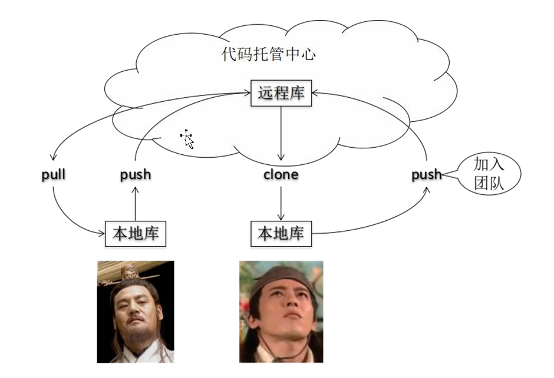
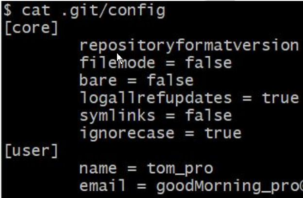
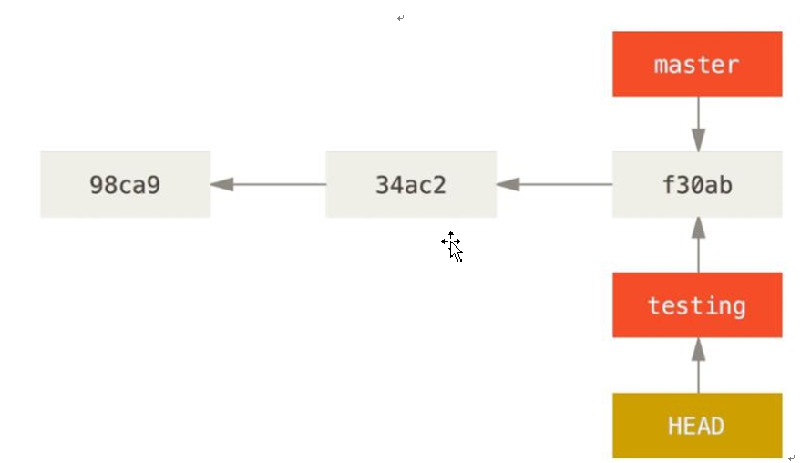
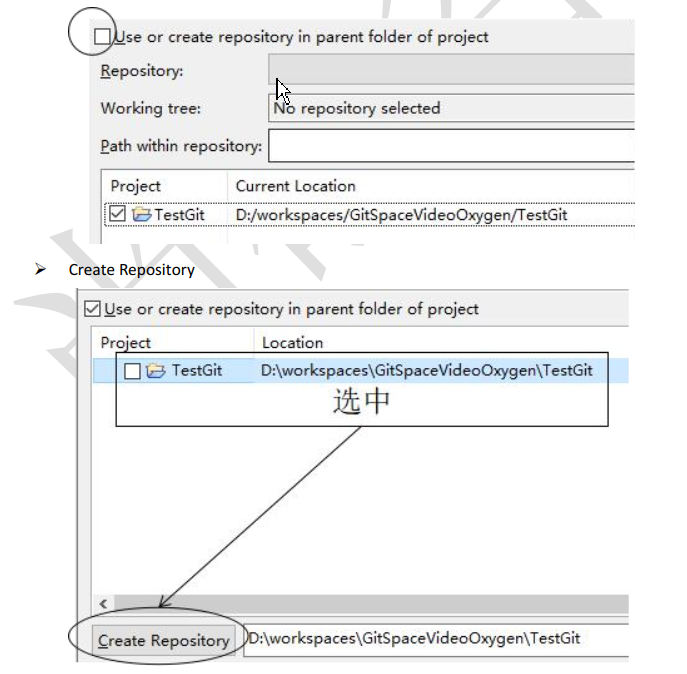
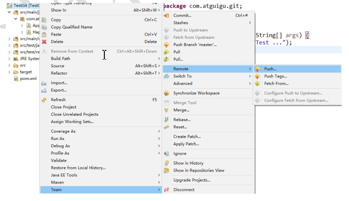
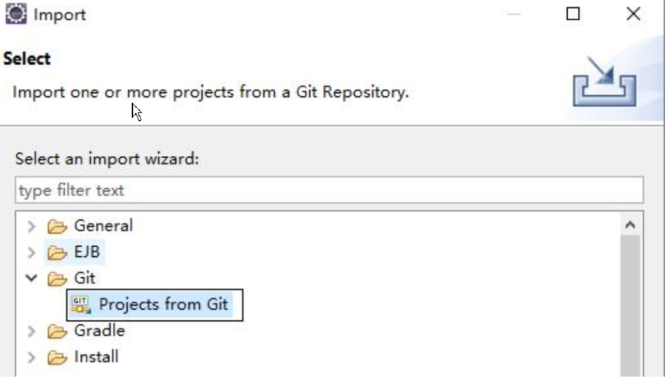
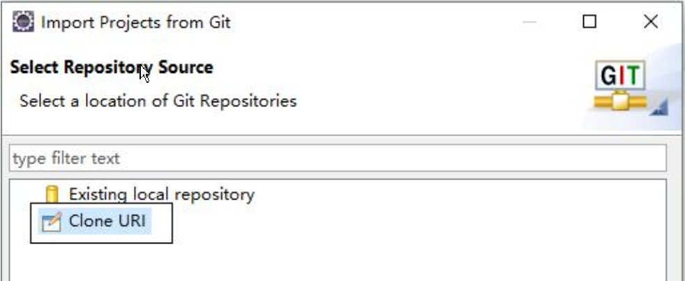
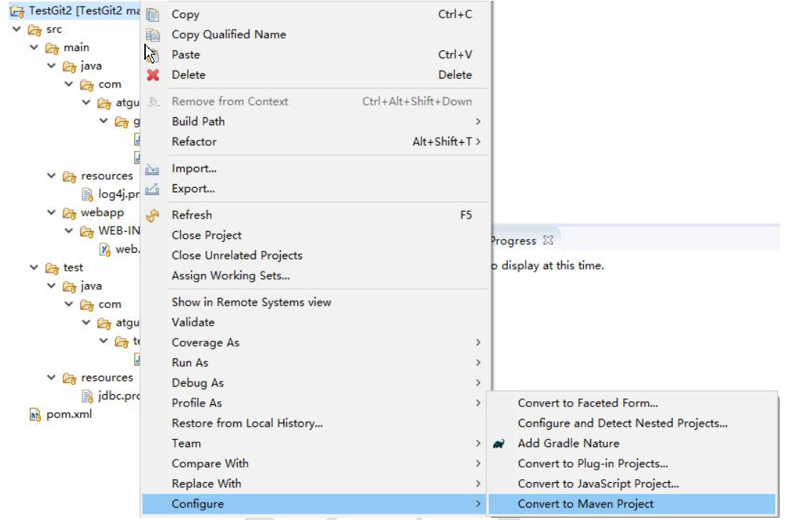

# Git&GitHub 

## 版本控制工具应该具备的功能 	

### 协同修改 

多人并行不悖的修改服务器端的同一个文件 

### 数据备份 

不仅保存目录和文件的当前状态， 还能够保存每一个提交过的历史状态 

### 版本管理 

在保存每一个版本的文件信息的时候要做到不保存重复数据， 以节约存储空间， 提高运行效率。 这方面 SVN 采用的是增量式管理的方式， 而 Git 采取了文件系统快照的方式 

### 权限控制 

对团队中参与开发的人员进行权限控制。 

对团队外开发者贡献的代码进行审核——Git 独有。 

### 历史记录 

查看修改人、 修改时间、 修改内容、 日志信息。 

将本地文件恢复到某一个历史状态。 

### 分支管理 

允许开发团队在工作过程中多条生产线同时推进任务， 进一步提高效率。 


## 版本控制简介 

### 版本控制 

工程设计领域中使用版本控制管理工程蓝图的设计过程。 在 IT 开发过程中也可以使用版本控制思想管理代码的版本迭代。 

### 版本控制工具 

思想： 版本控制
实现： 版本控制工具

**集中式版本控制工具：CVS、 SVN、 VSS……** 


**分布式版本控制工具：Git、 Mercurial、 Bazaar、 Darcs……** 


## Git 简介 

### Git 简史 


### Git 官网和 Logo 

官网地址： https://git-scm.com/ 


### Git 的优势 

 大部分操作在本地完成， 不需要联网
 完整性保证
 尽可能添加数据而不是删除或修改数据
 分支操作非常快捷流畅
 与 Linux 命令全面兼容 

### Git 安装 


### Git 结构 


### Git 和代码托管中心 

代码托管中心的任务： 维护远程库 

**局域网环境下 :GitLab 服务器** 

**外网环境下 :GitHub  码云** 

​	

## 本地库和远程库 

### 团队内部协作 




### 跨团队协作 


## Git 命令行操作 

### 本地库初始化 

```git
命令： git init
```

效果 

注意： .git 目录中存放的是本地库相关的子目录和文件， 不要删除， 也不要胡乱修改。 

### 设置签名 

形式 

```.git
用户名： tom
Email 地址： goodMorning@hgx.com
```

作用： 区分不同开发人员的身份 

辨析： 这里设置的签名和登录远程库(代码托管中心)的账号、 密码没有任何关系 

命令 :

**项目级别/仓库级别： 仅在当前本地库范围内有效** 

```git
git config user.name tom_pro
git config user.email goodMorning_pro@hgx.com
```

信息保存位置： ./.git/config 文件 




**系统用户级别： 登录当前操作系统的用户范围** 

```git
git config --global user.name tom_glb
git config --global user.email goodMorning_pro@hgx.com
```

信息保存位置： ~/.gitconfig 文件 


### 级别优先级 

 就近原则： 项目级别优先于系统用户级别， 二者都有时采用项目级别的签名
 如果只有系统用户级别的签名， 就以系统用户级别的签名为准
 二者都没有不允许 

### 基本操作

#### 状态查看  

```git
git status
```

查看工作区、 暂存区状态 

#### 添加 

```git
git add [file name]
```

将工作区的“新建/修改” 添加到暂存区 

#### 提交 

```git
git commit -m "commit message" [file name]
```

将暂存区的内容提交到本地库 

#### 查看历史记录 

```git
git log
```


多屏显示控制方式：
空格向下翻页
b 向上翻页
q 退出 

```git
git log --pretty=oneline
```


```git
git log --oneline
```


```git
git reflog
```


HEAD@{移动到当前版本需要多少步} 

### 前进后退 

#### 本质 


**基于索引值操作[推荐]** 

```git
git reset --hard [局部索引值]
git reset --hard a6ace91
```

**使用^符号： 只能后退** 

```git
 git reset --hard HEAD^
 注： 一个^表示后退一步， n 个表示后退 n 步
```

**使用~符号： 只能后退** 

```git
 git reset --hard HEAD~n
 注： 表示后退 n 步
```

#### reset 命令的三个参数对比 

**--soft 参数** 

仅仅在本地库移动 HEAD 指针 


**--mixed 参数** 

在本地库移动 HEAD 指针 

重置暂存区 


**--hard 参数** 

 在本地库移动 HEAD 指针
 重置暂存区
 重置工作区


## 删除文件并找回 

前提： 删除前， 文件存在时的状态提交到了本地库。 

操作： git reset --hard [指针位置] 

​	删除操作已经提交到本地库： 指针位置指向历史记录 

​	删除操作尚未提交到本地库： 指针位置使用 HEAD 


## 比较文件差异 

```git
git diff [文件名]
```

将工作区中的文件和暂存区进行比较 

```git
git diff [本地库中历史版本] [文件名]
```

将工作区中的文件和本地库历史记录比较 

**不带文件名比较多个文件** 


## 分支管理 

### 什么是分支？ 

在版本控制过程中， 使用多条线同时推进多个任务 


### 分支的好处？ 

同时并行推进多个功能开发， 提高开发效率 

各个分支在开发过程中， 如果某一个分支开发失败， 不会对其他分支有任何影响。 失败的分支删除重新开始即可。 

### 分支操作 

#### 创建分支 

```git
git branch [分支名]
```

#### 查看分支 

```git
git branch -v
```

#### 切换分支 

```git
git checkout [分支名]
```

#### 合并分支 

第一步： 切换到接受修改的分支（被合并， 增加新内容） 上

```git
git checkout [被合并分支名] 
```

第二步： 执行 merge 命令 

```git
git merge [有新内容分支名]
```

#### 解决冲突 

冲突的表现 


#### 冲突的解决 

第一步： 编辑文件， 删除特殊符号 

第二步： 把文件修改到满意的程度， 保存退出 

第三步： git add [文件名] 

第四步： git commit -m "日志信息" 

​	**注意： 此时 commit 一定不能带具体文件名** 


## Git 基本原理 

### 哈希 


哈希是一个系列的加密算法， 各个不同的哈希算法虽然加密强度不同， 但是有以下几个共同点：
①不管输入数据的数据量有多大， 输入同一个哈希算法， 得到的加密结果长度固定。
②哈希算法确定， 输入数据确定， 输出数据能够保证不变
③哈希算法确定， 输入数据有变化， 输出数据一定有变化， 而且通常变化很大
④哈希算法不可逆
Git 底层采用的是 SHA-1 算法。
哈希算法可以被用来验证文件。 原理如下图所示： 


Git 就是靠这种机制来从根本上保证数据完整性的。 

### Git 保存版本的机制 

#### 集中式版本控制工具的文件管理机制 

以文件变更列表的方式存储信息。 这类系统将它们保存的信息看作是一组基本文件和每个文件随时间逐步累积的差异 


#### Git 的文件管理机制 

Git 把数据看作是小型文件系统的一组快照。 每次提交更新时 Git 都会对当前的全部文件制作一个快照并保存这个快照的索引。 为了高效， 如果文件没有修改，Git 不再重新存储该文件， 而是只保留一个链接指向之前存储的文件。 所以 Git 的工作方式可以称之为快照流。 


### Git 文件管理机制细节 

Git 的“提交对象” 


提交对象及其父对象形成的链条 


### Git 分支管理机制 

#### 分支的创建 


#### 分支的切换 




## GitHub 

### 账号信息 

GitHub 首页就是注册页面： https://github.com/ 

### 创建远程库 


### 创建远程库地址别名 

```git
git remote -v 查看当前所有远程地址别名
git remote add [别名] [远程地址]
```

### 推送 

```git
git push [别名] [分支名]
```

### 克隆 	

```git
git origin [远程地址] 

效果
 完整的把远程库下载到本地
 创建 origin 远程地址别名
 初始化本地库
```

### 团队成员邀请 


“仓库所有者” 其他方式把邀请链接发送给“被邀请者” ， “被邀请者” 登录自己的 GitHub账号， 访问邀请链接。 


### 拉取 

```git
 pull=fetch+merge
 git fetch [远程库地址别名] [远程分支名]
 git merge [远程库地址别名/远程分支名]
 git pull [远程库地址别名] [远程分支名]
```

### 解决冲突 

**要点** 

如果不是基于 GitHub 远程库的最新版所做的修改， 不能推送， 必须先拉取。 

拉取下来后如果进入冲突状态， 则按照“分支冲突解决” 操作解决即可 .

**类比** 

债权人： 老王 

债务人： 小刘 

老王说： 10 天后归还。 小刘接受， 双方达成一致。 

老王媳妇说： 5 天后归还。 小刘不能接受。 老王媳妇需要找老王确认后再执行。 

### 跨团队协作 

#### Fork 


本地修改， 然后推送到远程 

#### Pull Request 


#### 对话 

#### 审核代码 


#### 合并代码 


#### 将远程库修改拉取到本地 


## SSH 登录 

进入当前用户的家目录 

```git
cd ~
```

删除.ssh 目录 

```git
 rm -rvf .ssh
```

运行命令生成.ssh 密钥目录 

```git
ssh-keygen -t rsa -C hgx@aliyun.com  //github的账号邮箱,[注意： 这里-C 这个参数是大写的 C]
```

进入.ssh 目录查看文件列表 

```git
$ cd .ssh
$ ls -lF
```

查看 id_rsa.pub 文件内容 

```git
$ cat id_rsa.pub
```

复制 id_rsa.pub 文件内容， 登录 GitHub， 点击用户头像→Settings→SSH and GPG keys 

New SSH Key 

输入复制的密钥信息 

回到 Git bash 创建远程地址别名 

git remote add origin_ssh git@github.com:hgx/huashan.git 

推送文件进行测试 

## Eclipse 操作 

### 工程初始化为本地库 

工程→右键→Team→Share Project→Git 



### Eclipse 中忽略文件 

 **概念： Eclipse 特定文件**
这些都是 Eclipse 为了管理我们创建的工程而维护的文件， 和开发的代码没有直接关系。 最好不要在 Git 中进行追踪， 也就是把它们忽略。
.classpath 文件
.project 文件
.settings 目录下所有文件
 **为什么要忽略 Eclipse 特定文件呢？**
同一个团队中很难保证大家使用相同的 IDE 工具， 而 IDE 工具不同时， 相关工程特定文件就有可能不同。 如果这些文件加入版本控制， 那么开发时很可能需要为了这些文件解决冲突。 

 **GitHub 官网样例文件**
https://github.com/github/gitignore
https://github.com/github/gitignore/blob/master/Java.gitignore
 **编辑本地忽略配置文件， 文件名任意** 

```git
//文件名 Java.gitignore
# Compiled class file
*.class
# Log file
*.log
# BlueJ files
*.ctxt
# Mobile Tools for Java (J2ME)
.mtj.tmp/
# Package Files #
*.jar
*.war
*.nar
*.ear
*.zip
*.tar.gz
*.rar
# virtual machine crash logs, see http://www.java.com/en/download/help/error_hotspot.xml
hs_err_pid*
.classpath
.project
.settings
target
```

 **在~/.gitconfig 文件中引入上述文件**
[core]
excludesfile = C:/Users/Lenovo/Java.gitignore
[注意： 这里路径中一定要使用“/” ， 不能使用“\” ] 

### 推送到远程库 




### Oxygen Eclipse 克隆工程操作 

Import...导入工程 





到远程库复制工程地址 

指定工程导入方式， 这里只能用： Import as general project 

转换工程类型 



### Kepler Eclipse 克隆工程操作 

问题： 不能保存到当前 Eclipse 工作区目录 

正确做法： 保存到工作区以外的目录中 

### 解决冲突 

冲突文件→右键→Team→Merge Tool
修改完成后正常执行 add/commit 操作即可 

## Git 工作流 

### 概念

在项目开发过程中使用 Git 的方式 

### 分类 

#### 集中式工作流 

像 SVN 一样， 集中式工作流以中央仓库作为项目所有修改的单点实体。 所有修改都提交到 Master 这个分支上。
这种方式与 SVN 的主要区别就是开发人员有本地库。Git 很多特性并没有用到。 

#### GitFlow 工作流 

Gitflow 工作流通过为功能开发、 发布准备和维护设立了独立的分支， 让发布迭代过程更流畅。 严格的分支模型也为大型项目提供了一些非常必要的结构。 

#### Forking 工作流 

Forking 工作流是在 GitFlow 基础上， 充分利用了 Git 的 Fork 和 pull request 的功能以达到代码审核的目的。 更适合安全可靠地管理大团队的开发者， 而且能接受不信任贡献者的提交。 

## Git问题

### RPC failed; curl 56 OpenSSL SSL_read: SSL_ERROR_SYSCALL, errno 10054

```git
LENOVO@hgx MINGW64 ~/Desktop/note (master)
$ git push https://github.com/huangguixin/note.git master
Counting objects: 83, done.
Delta compression using up to 4 threads.
Compressing objects: 100% (82/82), done.
error: RPC failed; curl 56 OpenSSL SSL_read: SSL_ERROR_SYSCALL, errno 10054
fataWriting objectsl: :T he remote  e7n5% (63d h/83), 11.95 MiB | 2un0.00 KiB/s p unexpectedly
Writing objects: 100% (83/83), 42.90 MiB | 348.00 KiB/s, done.
Total 83 (delta 4), reused 0 (delta 0)
fatal: The remote end hung up unexpectedly
Everything up-to-date
```

### 解决方法

**执行如下命令**

```git
git config http.sslVerify "false"
```


