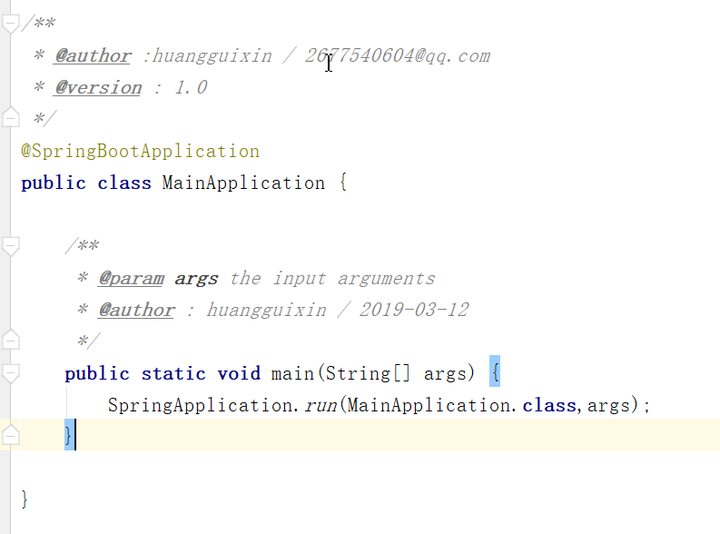

# IDEA软件的使用经验

## 一、快捷键的使用

### 1.Ctrl+Shift+J 

```xml
shortcut joins two lines into one and removes unnecessary space to match your code style.
快捷方式将两行连接到一起，并删除不必要的空间以匹配代码样式。
```

2.

```xml
Use Refactor | Copy to create a class which is a copy of the selected class. This can be useful, for example, when you need to create a class which has much in common with some existing class and it's not feasible to put the shared functionality in a common superclass.
使用重构|复制创建一个类，该类是所选类的副本。例如，当您需要创建一个与某些现有类有很多共同点的类，并且不能将共享的功能放在一个公共超类中时，这可能很有用。
```

3.Ctrl+Shift+V

```xml
Use the Ctrl+Shift+V shortcut to choose and insert recent clipboard contents into the text.
使用Ctrl+Shift+V快捷键选择并将最近的剪贴板内容插入文本。
```

4.Ctrl+H

```xml
To see the inheritance hierarchy for a selected class, press Ctrl+H (Navigate | Type Hierarchy). You can also invoke the hierarchy view right from the editor to see the hierarchy for the currently edited class.
要查看所选类的继承层次结构，请按Ctrl+H(导航|类型层次结构)。您还可以从编辑器中直接调用hierarchy视图来查看当前编辑的类的层次结构。
```


5.

```xml
Right-clicking on a breakpoint marker (on the bar to the left from the text) invokes the speedmenu where you can quickly enable/disable the breakpoint or adjust its properties.
右键单击断点标记(在文本左侧的栏上)将调用speedmenu，您可以在其中快速启用/禁用断点或调整其属性。
```


6.

```xml
To easily evaluate the value of any expression while debugging the program, select its text in the editor (you may press a Ctrl+W a few times to efficiently perform this operation) and press Alt+F8.
要在调试程序时方便地计算任何表达式的值，请在编辑器中选择它的文本(您可以按Ctrl+W几次以有效地执行此操作)并按Alt+F8。
```

7.

```xml
To quickly evaluate the value of any expression while debugging the program, hold Alt and click this expression to see its value and calculate it, call a method, etc.
要在调试程序时快速计算任何表达式的值，按住Alt键并单击该表达式以查看其值并计算它、调用方法等。
```


8.Alt+向上箭头 and Alt+向下箭头

```xml
Use Alt+向上箭头 and Alt+向下箭头 keys to quickly move between methods in the editor.
使用Alt +向上箭头和Alt +向下箭头键之间快速移动方法在编辑器中。
```

9.

```xml
Use Basic Completion (Ctrl+空格) for completing words in text and comments in files of many different types.
All the words from the current file that start with the typed prefix will appear in the lookup list.
使用基本完成(Ctrl +空格)完成单词在评论文本和许多不同类型的文件。
当前文件中以键入前缀开头的所有单词都将出现在查找列表中。
```


10

```xml
The shortcuts such as Ctrl+Q (View | Quick Documentation), Ctrl+P (View | Parameter Info), Ctrl+B (Navigate | Declaration) and others can be used not only in the editor but in the code completion popup list as well.
快捷键Ctrl+Q(查看| Quick Documentation)、Ctrl+P(查看|参数信息)、Ctrl+B(导航|声明)等不仅可以在编辑器中使用，还可以在代码完成弹出列表中使用。
```


11.

```xml
When using Code Completion, you can accept the currently highlighted selection in the popup list with the period character (.), comma (,), semicolon (;), space and other characters.
The selected name is automatically entered in the editor followed by the entered character.
使用代码补全时，可以接受弹出列表中当前突出显示的选择，其中包含句点字符(.)、逗号(，)、分号(;)、空格和其他字符。
在编辑器中自动输入所选名称，然后输入字符。
```

12

```xml
To help you learn the purpose of each item in the main menu, its short description is shown in the status bar at the bottom of the application frame when you position the mouse pointer over this item.
为了帮助您了解主菜单中每一项的用途，当您将鼠标指针置于该项上时，它的简短描述将显示在应用程序框架底部的状态栏中。
```

13

```xml
For the pattern search in the Go to Class, Go to Symbol and Go to File pop-up frames, use * and space symbols.
* stands for any symbols.
Space at the end means the end of a pattern, and the preceding string will be considered not just a prefix but a whole pattern. The list of the suggested names will be reduced accordingly.
要在Go to类中进行模式搜索，请转到Symbol并转到File弹出框，使用*和空格符号。
*代表任何符号。
末尾的空格表示模式的结束，前面的字符串不仅被视为前缀，还被视为整个模式。建议名单将相应减少。
```


## 二、插件的使用

### 1. JavaDoc2插件的使用

#### 1.1 下载并安装


#### 1.2 在IDEA的C:\Users\LENOVO\.IntelliJIdea2018.3\config\options这个目录下放入如下文件，重启IDEA，就可以使用了


#### 1.3该文件的链接

[](./intellij-javadocs.xml)     按ctrl键 + 鼠标点击进行

#### 1.4 使用快捷键说明

##### 1.4.1 Alt + Shift + G  为选中的生成注释

##### 1.4.2 Ctrl + Alt + Shift + G 为当前文件生成所有注释

##### 1.4.3 Alt + Shift + Z 为选中的取消 

##### 1.4.4 Ctrl + Alt + Shift + Z 为当前文件取消所有注释

#### 1.5 可以进入文件修改内容，修改成自己想要的


#### 1.6 使用的效果



