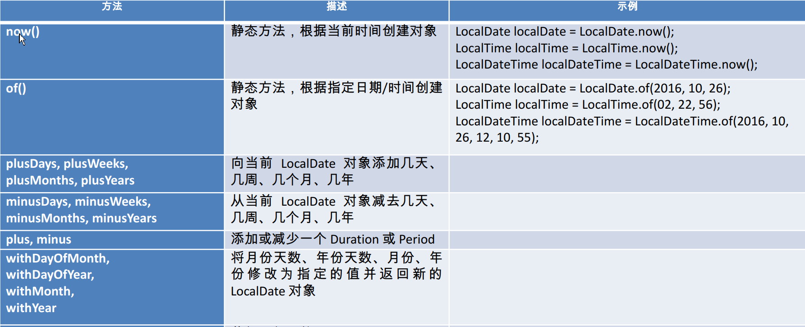
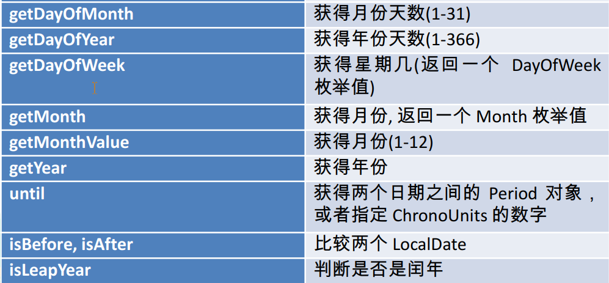
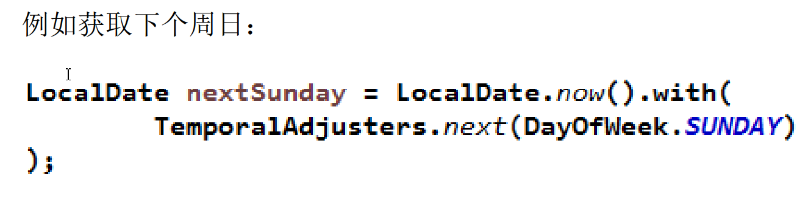
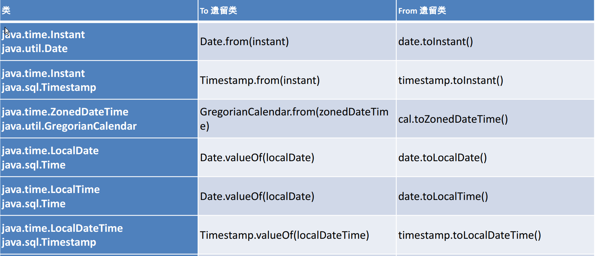
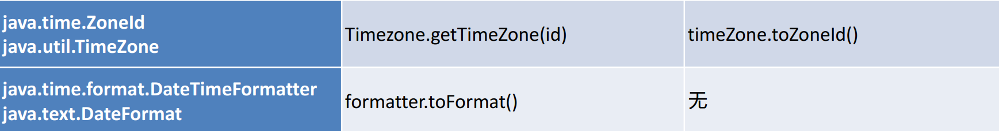

# Java8新时间日期API

## 一、Java8之前的时间日期API存在线程安全问题且包不规范

### 例子1:存在线程安全问题

```java
import java.text.SimpleDateFormat;
import java.util.ArrayList;
import java.util.Date;
import java.util.List;
import java.util.concurrent.Callable;
import java.util.concurrent.ExecutionException;
import java.util.concurrent.ExecutorService;
import java.util.concurrent.Executors;
import java.util.concurrent.Future;

public class TestSimpleDateFormat {
	
	public static void main(String[] args) throws Exception {
		
		SimpleDateFormat sdf = new SimpleDateFormat("yyyyMMdd");
		
		Callable<Date> task = new Callable<Date>() {

			@Override
			public Date call() throws Exception {
				return sdf.parse("20161121");
			}
			
		};

		ExecutorService pool = Executors.newFixedThreadPool(10);
		
		List<Future<Date>> results = new ArrayList<>();
		
		for (int i = 0; i < 10; i++) {
			results.add(pool.submit(task));
		}
		
		for (Future<Date> future : results) {
			System.out.println(future.get());
		}
		
		pool.shutdown();
		
	}

}
```

### 解决方案1：加锁

```java
import java.text.DateFormat;
import java.text.ParseException;
import java.text.SimpleDateFormat;
import java.util.Date;

public class DateFormatThreadLocal {
	
	private static final ThreadLocal<DateFormat> df = new ThreadLocal<DateFormat>(){
		
		protected DateFormat initialValue(){
			return new SimpleDateFormat("yyyyMMdd");
		}
		
	};
	
	public static final Date convert(String source) throws ParseException{
		return df.get().parse(source);
	}

}
```

```java
import java.text.SimpleDateFormat;
import java.util.ArrayList;
import java.util.Date;
import java.util.List;
import java.util.concurrent.Callable;
import java.util.concurrent.ExecutionException;
import java.util.concurrent.ExecutorService;
import java.util.concurrent.Executors;
import java.util.concurrent.Future;

public class TestSimpleDateFormat {
	
	public static void main(String[] args) throws Exception {
				
		Callable<Date> task = new Callable<Date>() {

			@Override
			public Date call() throws Exception {
				return DateFormatThreadLocal.convert(20180303);
			}
			
		};

		ExecutorService pool = Executors.newFixedThreadPool(10);
		
		List<Future<Date>> results = new ArrayList<>();
		
		for (int i = 0; i < 10; i++) {
			results.add(pool.submit(task));
		}
		
		for (Future<Date> future : results) {
			System.out.println(future.get());
		}
		
		pool.shutdown();
		
	}

}
```

### 解决方案2：Java8时间日期API

```java
import java.time.LocalDate;
import java.time.format.DateTimeFormatter;
import java.util.ArrayList;
import java.util.List;
import java.util.concurrent.Callable;
import java.util.concurrent.ExecutionException;
import java.util.concurrent.ExecutorService;
import java.util.concurrent.Executors;
import java.util.concurrent.Future;

public class TestSimpleDateFormat {
	
	public static void main(String[] args) throws Exception {
				
		DateTimeFormatter dtf = DateTimeFormatter.ofPattern("yyyyMMdd");
		
		Callable<LocalDate> task = new Callable<LocalDate>() {

			@Override
			public LocalDate call() throws Exception {
				LocalDate ld = LocalDate.parse("20161121", dtf);
				return ld;
			}
			
		};

		ExecutorService pool = Executors.newFixedThreadPool(10);
		
		List<Future<LocalDate>> results = new ArrayList<>();
		
		for (int i = 0; i < 10; i++) {
			results.add(pool.submit(task));
		}
		
		for (Future<LocalDate> future : results) {
			System.out.println(future.get());
		}
		
		pool.shutdown();
		
	}

}
```

## 二、LocalDate、 LocalTime、 LocalDateTime 

LocalDate、 LocalTime、 LocalDateTime 类的实例是不可变的对象，分别表示使用 ISO-8601日历系统的日期、时间、日期和时间。它们提供了简单的日期或时间，并不包含当前的时间信息。也不包含与时区相关的信息。 

注： ISO-8601日历系统是国际标准化组织制定的现代公民的日期和时间的表示法 





### 例子

```java
import java.time.DayOfWeek;
import java.time.Duration;
import java.time.Instant;
import java.time.LocalDate;
import java.time.LocalDateTime;
import java.time.OffsetDateTime;
import java.time.Period;
import java.time.ZoneId;
import java.time.ZoneOffset;
import java.time.ZonedDateTime;
import java.time.format.DateTimeFormatter;
import java.time.temporal.TemporalAdjusters;
import java.util.Set;

import org.junit.Test;

public class TestLocalDateTime {

  @Test
	public void test1(){
		LocalDateTime ldt = LocalDateTime.now();
		System.out.println(ldt);
		
		LocalDateTime ld2 = LocalDateTime.of(2016, 11, 21, 10, 10, 10);
		System.out.println(ld2);
		
		LocalDateTime ldt3 = ld2.plusYears(20);
		System.out.println(ldt3);
		
		LocalDateTime ldt4 = ld2.minusMonths(2);
		System.out.println(ldt4);
		
		System.out.println(ldt.getYear());
		System.out.println(ldt.getMonthValue());
		System.out.println(ldt.getDayOfMonth());
		System.out.println(ldt.getHour());
		System.out.println(ldt.getMinute());
		System.out.println(ldt.getSecond());
	}

}
```

## 三、Instant 时间戳 

用于“时间戳”的运算。它是以Unix元年(传统的设定为UTC时区1970年1月1日午夜时分)开始所经历的描述进行运算 

### 例子

```java
Instant : 时间戳。 （使用 Unix 元年  1970年1月1日 00:00:00 所经历的毫秒值）
	@Test
	public void test2(){
		Instant ins = Instant.now();  //默认使用 UTC 时区
		System.out.println(ins);
		
		OffsetDateTime odt = ins.atOffset(ZoneOffset.ofHours(8));//相差8个时区
		System.out.println(odt);
		
		System.out.println(ins.getNano());//获取纳秒值
		System.out.println(ins.toEpochMilli());//获取毫秒值
		
		Instant ins2 = Instant.ofEpochSecond(5); //相对于1970开始计算的
		System.out.println(ins2);
	}
```

## 四、Duration 和 Period 

**Duration:用于计算两个“时间”间隔**
**Period:用于计算两个“日期”间隔** 

例子：

```java
	//Duration : 用于计算两个“时间”间隔
	//Period : 用于计算两个“日期”间隔
	@Test
	public void test3(){
		Instant ins1 = Instant.now();
		
		System.out.println("--------------------");
		try {
			Thread.sleep(1000);
		} catch (InterruptedException e) {
		}
		
		Instant ins2 = Instant.now();
		
		System.out.println("所耗费时间为：" + Duration.between(ins1, ins2));
		
		System.out.println("----------------------------------");
		
		LocalDate ld1 = LocalDate.now();
		LocalDate ld2 = LocalDate.of(2011, 1, 1);
		
		Period pe = Period.between(ld2, ld1);
		System.out.println(pe.getYears());
		System.out.println(pe.getMonths());
		System.out.println(pe.getDays());
	}
```

## 五、日期的操纵 

TemporalAdjuster : 时间校正器。有时我们可能需要获
取例如：将日期调整到“下个周日”等操作。

 TemporalAdjusters : 该类通过静态方法提供了大量的常
用 TemporalAdjuster 的实现。 




```java
 TemporalAdjuster : 时间校正器
	@Test
	public void test4(){
	LocalDateTime ldt = LocalDateTime.now();
		System.out.println(ldt);
		
		LocalDateTime ldt2 = ldt.withDayOfMonth(10);
		System.out.println(ldt2);
		
		LocalDateTime ldt3 = ldt.with(TemporalAdjusters.next(DayOfWeek.SUNDAY));
		System.out.println(ldt3);
		
		//自定义：下一个工作日
		LocalDateTime ldt5 = ldt.with((l) -> {
			LocalDateTime ldt4 = (LocalDateTime) l;
			
			DayOfWeek dow = ldt4.getDayOfWeek();
			
			if(dow.equals(DayOfWeek.FRIDAY)){
				return ldt4.plusDays(3);
			}else if(dow.equals(DayOfWeek.SATURDAY)){
				return ldt4.plusDays(2);
			}else{
				return ldt4.plusDays(1);
			}
		});
		
		System.out.println(ldt5);
		
	}
```

## 六、解析与格式化 

java.time.format.DateTimeFormatter 类：该类提供了三种
格式化方法： 

预定义的标准格式
语言环境相关的格式

自定义的格式 

```java
	DateTimeFormatter : 解析和格式化日期或时间
	@Test
	public void test5(){
//		DateTimeFormatter dtf = DateTimeFormatter.ISO_LOCAL_DATE;
		
		DateTimeFormatter dtf = DateTimeFormatter.ofPattern("yyyy年MM月dd日 HH:mm:ss E");
		
		LocalDateTime ldt = LocalDateTime.now();
		String strDate = ldt.format(dtf);
		
		System.out.println(strDate);
		
		LocalDateTime newLdt = ldt.parse(strDate, dtf);
		System.out.println(newLdt);
	}
```

## 七、时区的处理 

Java8 中加入了对时区的支持，带时区的时间为分别为：
ZonedDate、 ZonedTime、 ZonedDateTime
其中每个时区都对应着 ID，地区ID都为 “ {区域}/{城市}”的格式
例如 ： Asia/Shanghai 等
ZoneId：该类中包含了所有的时区信息
getAvailableZoneIds() : 可以获取所有时区时区信息
of(id) : 用指定的时区信息获取 ZoneId 对象 

**与传统日期处理的转换** 





### 例子：

```java
ZonedDate、ZonedTime、ZonedDateTime ： 带时区的时间或日期
	@Test
	public void test7(){
		LocalDateTime ldt = LocalDateTime.now(ZoneId.of("Asia/Shanghai"));
		System.out.println(ldt);
		
		ZonedDateTime zdt = ZonedDateTime.now(ZoneId.of("US/Pacific"));
		System.out.println(zdt);
	}
	
	@Test
	public void test6(){
		Set<String> set = ZoneId.getAvailableZoneIds();
		set.forEach(System.out::println);
	}
```

