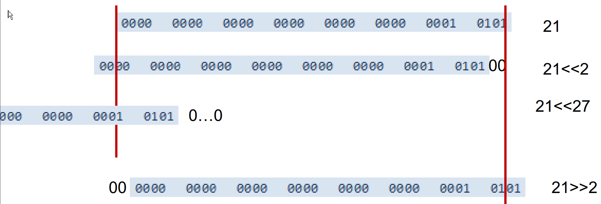
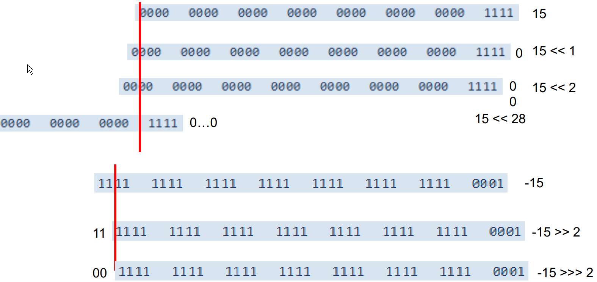
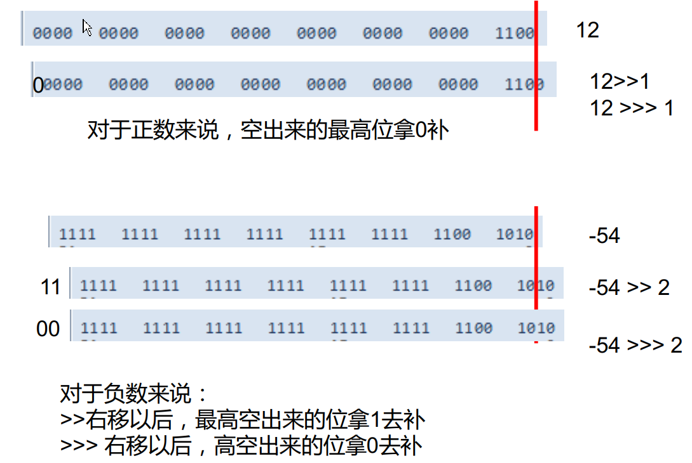
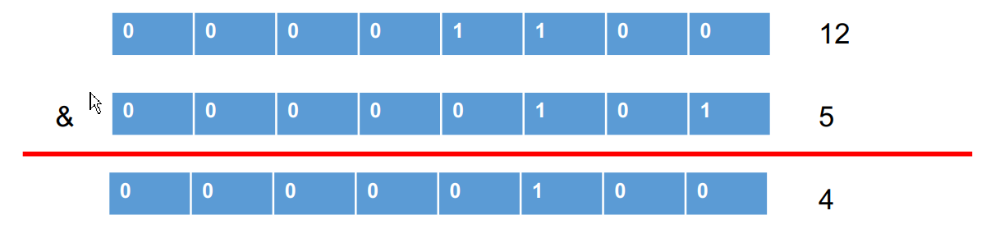
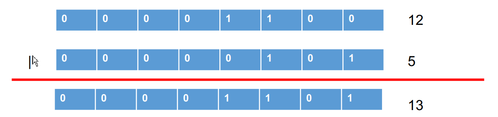
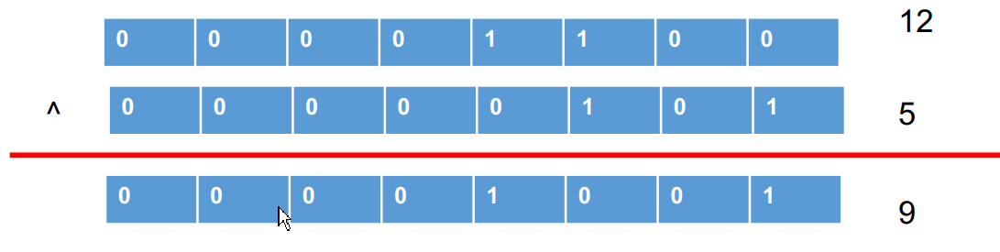
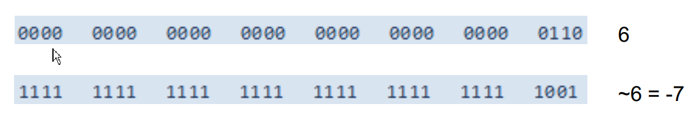
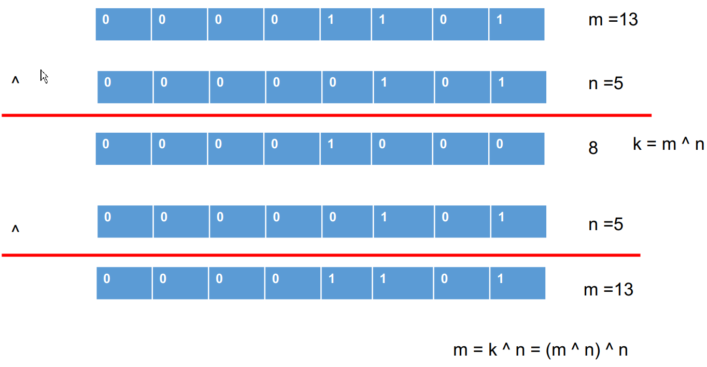

# 运算符

## 一、逻辑运算符

&—逻辑与 | —逻辑或 ！ —逻辑非
&& —短路与 || —短路或 ^ —逻辑异或 

| a     | b     | a&b   | a&&b  | a\|b  | a\|\|b | !a    | a^b   |
| ----- | ----- | ----- | ----- | ----- | ------ | ----- | ----- |
| true  | true  | true  | true  | true  | true   | false | false |
| true  | false | false | false | true  | true   | false | true  |
| false | true  | false | false | true  | true   | true  | true  |
| false | false | false | false | false | false  | true  | false |

逻辑运算符用于连接布尔型表达式，在Java中不可以写成3<x<6，应该写成x>3 & x<6 。
“&”和“&&”的区别：
单&时，左边无论真假，右边都进行运算；
双&时，如果左边为真，右边参与运算，如果左边为假，那么右边不参与运算。
“|”和“||”的区别同理， ||表示：当左边为真，右边不参与运算。
异或( ^ )与或( | )的不同之处是：当左右都为true时，结果为false。理解：异或，追求的是“异” ! 


### 练习：请写出每题的输出结果


```java
int x = 1;

int y=1;

if(x++==2 & ++y==2){

x =7;

}

System.out.println("x="+x+",y="+y);

答：x=2，y=2


int x = 1,y = 1;

if(x++==2 && ++y==2){

x =7;

}

System.out.println("x="+x+",y="+y);

答：x=2，y=1

int x = 1,y = 1;

if(x++==1 | ++y==1){

x =7;

}

System.out.println("x="+x+",y="+y);

答：x=7，y=2

int x = 1,y = 1;

if(x++==1 || ++y==1){

x =7;

}

System.out.println("x="+x+",y="+y); 

答：x=7，y=1
```


### 【 面试题】 程序输出： 

```java
class Test {

public static void main (String [] args) {

boolean x=true;

boolean y=false;

short z=42;

 //if(y == true)

if((z++==42)&&(y=true))z++;

if((x=false) || (++z==45)) z++;

System. out.println(“z=”+z);}

}

结果为：z= 46 

```


### 例子：

```java
/*
运算符之四：逻辑运算符

&  && |  || ! ^

说明：
1.逻辑运算符操作的都是boolean类型的变量


*/
class LogicTest {
	public static void main(String[] args) {
		
		//区分& 与 &&
		//相同点1：& 与  && 的运算结果相同
		//相同点2：当符号左边是true时，二者都会执行符号右边的运算
		//不同点：当符号左边是false时，&继续执行符号右边的运算。&&不再执行符号右边的运算。
		//开发中，推荐使用&&
		boolean b1 = true;
		b1 = false;
		int num1 = 10;
		if(b1 & (num1++ > 0)){
			System.out.println("我现在在北京");
		}else{
			System.out.println("我现在在南京");
		}

		System.out.println("num1 = " + num1);
		

		boolean b2 = true;
		b2 = false;
		int num2 = 10;
		if(b2 && (num2++ > 0)){
			System.out.println("我现在在北京");
		}else{
			System.out.println("我现在在南京");
		}

		System.out.println("num2 = " + num2);

		// 区分：| 与 || 
		//相同点1：| 与  || 的运算结果相同
		//相同点2：当符号左边是false时，二者都会执行符号右边的运算
		//不同点3：当符号左边是true时，|继续执行符号右边的运算，而||不再执行符号右边的运算
		//开发中，推荐使用||
		boolean b3 = false;
		b3 = true;
		int num3 = 10;
		if(b3 | (num3++ > 0)){
			System.out.println("我现在在北京");
		}else{
			System.out.println("我现在在南京");
		}
		System.out.println("num3 = " + num3);


		boolean b4 = false;
		b4 = true;
		int num4 = 10;
		if(b4 || (num4++ > 0)){
			System.out.println("我现在在北京");
		}else{
			System.out.println("我现在在南京");
		}
		System.out.println("num4 = " + num4);
	}
}

```


## 二、位运算符 

注意：无<<< 

| 位运算符 |       |                          |
| ---- | ----- | ------------------------ |
| 运算符  | 运算    | 范例                       |
| <<   | 左移    | 3 << 2 = 12 --> 3*2*2=12 |
| >>   | 右移    | 3 >> 1 = 1 --> 3/2=1     |
| >>>  | 无符号右移 | 3 >>> 1 = 1 --> 3/2=1    |
| &    | 与运算   | 6 & 3 = 2                |
| \|   | 或运算   | 6 \| 3 = 7               |
| ^    | 异或运算  | 6 ^ 3 = 5                |
| ~    | 取反运算  | ~6 = -7                  |

**位运算是直接对整数的二进制进行的运算** 




| 位运算符的细节 |                                          |
| ------- | ---------------------------------------- |
| <<      | 空位补0，被移除的高位丢弃，空缺位补0。                     |
| >>      | 被移位的二进制最高位是0，右移后，空缺位补0；最高位是1，空缺位补1。      |
| >>>     | 被移位二进制最高位无论是0或者是1，空缺位都用0补。               |
| &       | 二进制位进行&运算，只有1&1时结果是1，否则是0;               |
| \|      | 二进制位进行 \| 运算，只有0 \| 0时结果是0，否则是1;         |
| ^       | 相同二进制位进行 ^ 运算，结果是0； 1^1=0 , 0^0=0不相同二进制位 ^ 运算结果是1。 1^0=1 , 0^1=1 |
| ~       | 正数取反，各二进制码按补码各位取反负数取反，各二进制码按补码各位取反       |





















### 例子：

```java
/*
运算符之五：位运算符 （了解）

结论：
1. 位运算符操作的都是整型的数据
2. << ：在一定范围内，每向左移1位，相当于 * 2
   >> :在一定范围内，每向右移1位，相当于 / 2


面试题：最高效方式的计算2 * 8 ？  2 << 3  或 8 << 1
*/
class BitTest {
	public static void main(String[] args) {
		int i = 21;
		i = -21;
		System.out.println("i << 2 :" + (i << 2));
		System.out.println("i << 3 :" + (i << 3));
		System.out.println("i << 27 :" + (i << 27));

		int m = 12;
		int n = 5;
		System.out.println("m & n :" + (m & n));
		System.out.println("m | n :" + (m | n));
		System.out.println("m ^ n :" + (m ^ n));

		//练习：交换两个变量的值
		int num1 = 10;
		int num2 = 20;
		System.out.println("num1 = " + num1 + ",num2 = " + num2);

		//方式一：定义临时变量的方式
		//推荐的方式
		int temp = num1;
		num1 = num2;
		num2 = temp;

		//方式二：好处：不用定义临时变量  
		//弊端：① 相加操作可能超出存储范围 ② 有局限性：只能适用于数值类型
		//num1 = num1 + num2;
		//num2 = num1 - num2;
		//num1 = num1 - num2;

		//方式三：使用位运算符
		//有局限性：只能适用于数值类型
		//num1 = num1 ^ num2;
		//num2 = num1 ^ num2;
		//num1 = num1 ^ num2;

		System.out.println("num1 = " + num1 + ",num2 = " + num2);

	}
}

```


