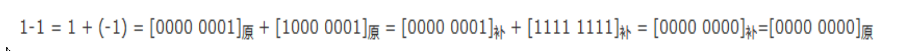
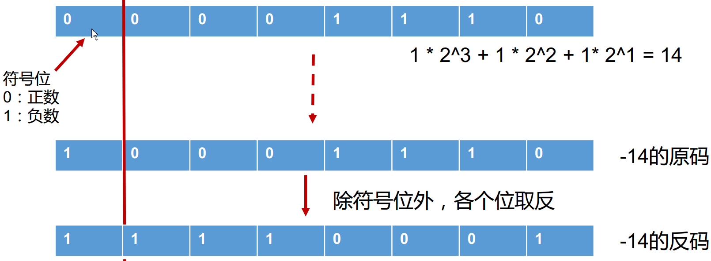
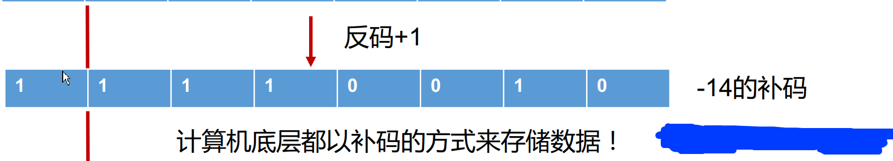
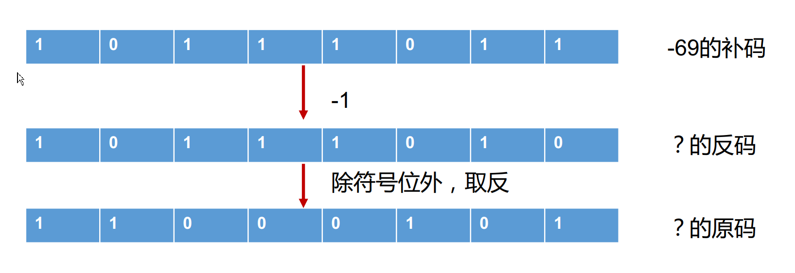
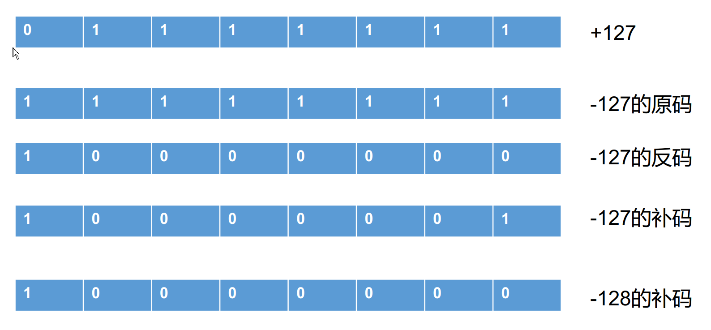
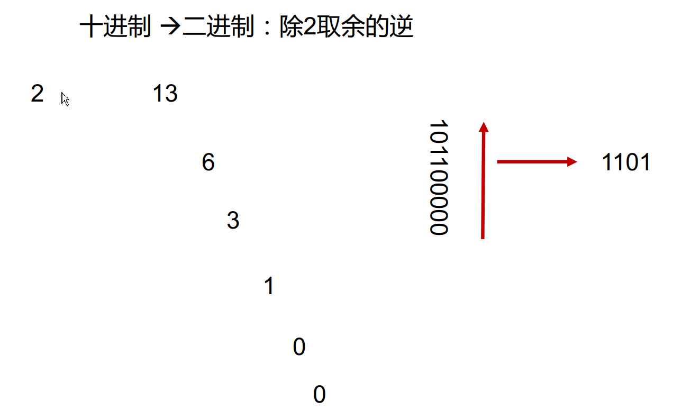
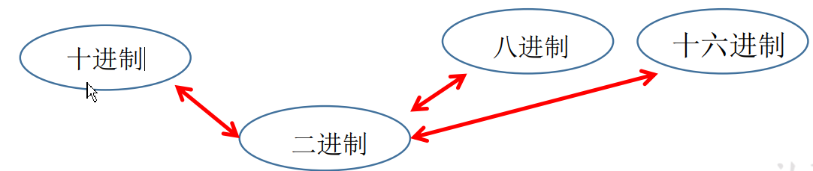
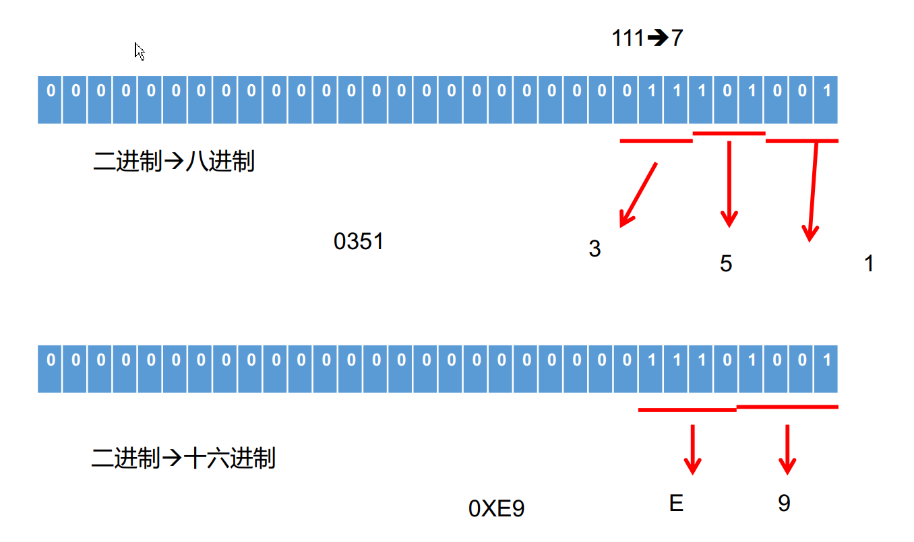
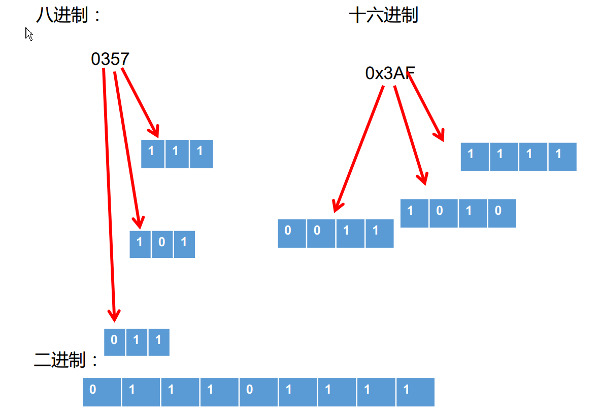

# 进制

世界上有10种人 ，认识和不认识二进制的。 

关于进制
 所有数字在计算机底层都以二进制形式存在。
 对于整数，有四种表示方式：
二进制(binary)： 0,1 ，满2进1.以0b或0B开头。
十进制(decimal)： 0-9 ，满10进1。
八进制(octal)： 0-7 ，满8进1. 以数字0开头表示。
十六进制(hex)： 0-9及A-F，满16进1. 以0x或0X开头表示。此处的A-F不区分大小写。
如： 0x21AF +1= 0X21B0 


| 十进制  | 十六进制 | 八进制  | 二进制  |
| ---- | ---- | ---- | ---- |
| 0    | 0    | 0    | 0    |
| 1    | 1    | 1    | 1    |
| 2    | 2    | 2    | 10   |
| 3    | 3    | 3    | 11   |
| 4    | 4    | 4    | 100  |
| 5    | 5    | 5    | 101  |
| 6    | 6    | 6    | 110  |
| 7    | 7    | 7    | 111  |
| 8    | 8    | 10   | 1000 |

| 十进制  | 十六进制 | 八进制  | 二进制   |
| ---- | ---- | ---- | ----- |
| 9    | 9    | 11   | 1001  |
| 10   | A    | 12   | 1010  |
| 11   | B    | 13   | 1011  |
| 12   | C    | 14   | 1100  |
| 13   | D    | 15   | 1101  |
| 14   | E    | 16   | 1110  |
| 15   | F    | 17   | 1111  |
| 16   | 10   | 20   | 10000 |
| 17   | 11   | 21   | 10001 |

二进制
Java整数常量默认是int类型，当用二进制定义整数时，其第32位是符号位；
当是long类型时，二进制默认占64位，第64位是符号位
二进制的整数有如下三种形式：
原码：直接将一个数值换成二进制数。最高位是符号位
负数的反码：是对原码按位取反，只是最高位（符号位）确定为1。
负数的补码：其反码加1。
计算机以二进制补码的形式保存所有的整数。
正数的原码、反码、补码都相同
负数的补码是其反码+1 


为什么要使用原码、反码、补码表示形式呢？
计算机辨别“符号位”显然会让计算机的基础电路设计变得十分复杂! 于是
人们想出了将符号位也参与运算的方法. 我们知道, 根据运算法则减去一个正
数等于加上一个负数, 即: 1-1 = 1 + (-1) = 0 , 所以机器可以只有加法而没有
减法, 这样计算机运算的设计就更简单了。 





## 二进制转十进制











对于正数来讲：原码、反码、补码是相同的：三码合一。
计算机底层都是使用二进制表示的数值
计算机底层都是使用的数值的补码保存数据的。 


十进制二进制：除2取余的逆 


## 进制间转化 

进制的基本转换
十进制 二进制互转
 二进制转成十进制 乘以2的幂数
 十进制转成二进制 除以2取余数
二进制 八进制互转
二进制 十六进制互转
十进制 八进制互转
十进制 十六进制互转 









```java
/*
计算机中不同进制的使用说明

对于整数，有四种表示方式：
> 二进制(binary)：0,1 ，满2进1.以0b或0B开头。
> 十进制(decimal)：0-9 ，满10进1。
> 八进制(octal)：0-7 ，满8进1. 以数字0开头表示。
> 十六进制(hex)：0-9及A-F，满16进1. 以0x或0X开头表示。此处的A-F不区分大小写。
    如：0x21AF +1= 0X21B0


*/
class BinaryTest {
	public static void main(String[] args) {
		
		int num1 = 0b110;
		int num2 = 110;
		int num3 = 0127;
		int num4 = 0x110A;

		System.out.println("num1 = " + num1);
		System.out.println("num2 = " + num2);
		System.out.println("num3 = " + num3);
		System.out.println("num4 = " + num4);

	}
}

```

