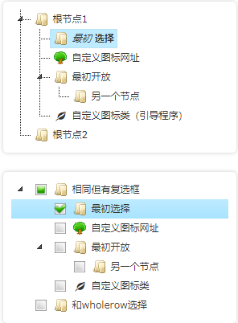
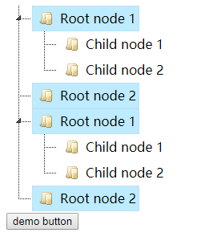
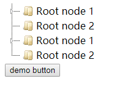

# jsTree

## 一、是什么

jsTree是**jquery插件**，提供**交互式树**。它完全**免费**，[开源](https://github.com/vakata/jstree/)并在[MIT许可](https://raw.githubusercontent.com/vakata/jstree/master/LICENSE-MIT)下分发。jsTree易于扩展，可扩展，可配置，支持**HTML和JSON数据源以及AJAX加载**。

jsTree在箱型（内容盒或边框）中正常运行，可作为AMD模块加载，并具有内置的移动主题，可进行响应式设计，可轻松定制。它使用jQuery的事件系统，因此对树中各种事件的绑定回调很熟悉且容易。

[官网地址](https://www.jstree.com/docs/config/)



## 二、使用

### 引入css

```css
<link rel="stylesheet" href="https://cdnjs.cloudflare.com/ajax/libs/jstree/3.2.1/themes/default/style.min.css" />
```

### 引入js

```js
//jsTree 在您的网页中需要1.9.0或更高版本。您可以使用CDN版本或包含本地副本。
<script src="https://cdnjs.cloudflare.com/ajax/libs/jquery/1.12.1/jquery.min.js"></script>
<script src="https://cdnjs.cloudflare.com/ajax/libs/jstree/3.2.1/jstree.min.js"></script>
```

### 页面

```html
 <div id="jstree_demo_div"></div>
```

### 实例化

```html
$(function () { $('#jstree_demo_div').jstree(); });
```

### 事件

当用户（或您）与树交互时，jsTree会使用事件通知您何时发生更改。因此，绑定到jstree事件就像轻松绑定到单击一样。有一个[事件列表](https://www.jstree.com/api/#/?q=.jstree%20Event)以及它们在API文档中提供的信息。

```html
$('#jstree_demo_div').on("changed.jstree", function (e, data) {
  console.log(data.selected);
});
```

### demo

```html
<!DOCTYPE html>
<html lang="en">
<head>
    <meta charset="UTF-8">
    <title>jstree</title>
    <link rel="stylesheet" href="https://cdnjs.cloudflare.com/ajax/libs/jstree/3.2.1/themes/default/style.min.css" />
</head>
<body>
<!-- 3 setup a container element -->
<div id="jstree">
    <!-- in this example the tree is populated from inline HTML -->
    <ul>
        <li>Root node 1
            <ul>
                <li id="child_node_1">Child node 1</li>
                <li>Child node 2</li>
            </ul>
        </li>
        <li>Root node 2</li>
    </ul>
    <ul>
        <li>Root node 1
            <ul>
                <li id="child_node_2">Child node 1</li>
                <li>Child node 2</li>
            </ul>
        </li>
        <li>Root node 2</li>
    </ul>
</div>
<button>demo button</button>
<script src="https://cdnjs.cloudflare.com/ajax/libs/jquery/1.12.1/jquery.min.js"></script>
<script src="https://cdnjs.cloudflare.com/ajax/libs/jstree/3.2.1/jstree.min.js"></script>
<script>
    $(function () {
        // 6 create an instance when the DOM is ready
        $.jstree.defaults.core.themes.variant = "large";
        $('#jstree').jstree();
        // 7 bind to events triggered on the tree
        $('#jstree').on("changed.jstree", function (e, data) {
            console.log(data.selected);
        });
        // 8 interact with the tree - either way is OK
        $('button').on('click', function () {
            $('#jstree').jstree(true).select_node('child_node_1');
            $('#jstree').jstree('select_node', 'child_node_1');
            $.jstree.reference('#jstree').select_node('child_node_1');
        });
    });
</script>
</body>
</html>
```

### 效果

  ```html
 $.jstree.defaults.core.themes.variant = "large"; //垂直高度变高一些
  ```







**默认情况下，树允许进行多次选择**

```html
$.jstree.defaults.core.multiple = false  //不予许多选
```


## 三、参考资料

[jsTree API文档（中文）](https://blog.csdn.net/j1137573560/article/details/82821839)

[插件集](http://k.swao.cn/js/web/plugin/template/cloudzoom.html)

