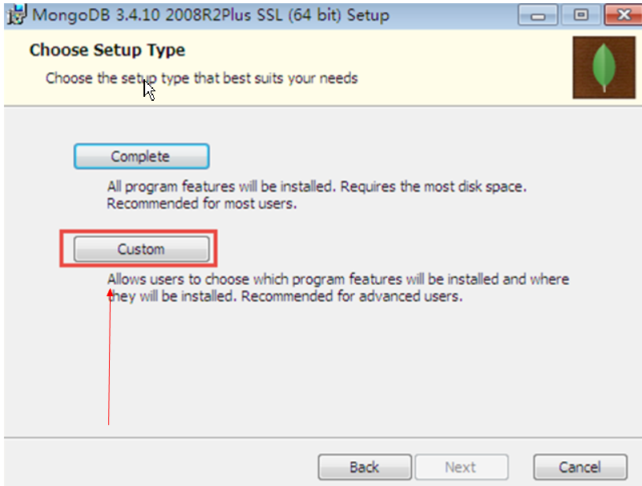

# mongodb安装 （window）

## mongodb介绍 


## 下载mongodb 

MongoDB 提供了可用于 32 位和 64 位系统的预编译二进制包，你可以从MongoDB官网下载安装。
官方地址：https://www.mongodb.com/
本次下载3.4版本：http://downloads.mongodb.org/win32/mongodb-win32-x86_64-2008plus-ssl-v3.4-
latest-signed.msi 


## 安装mongodb 

在win7系统安装mongodb需要vc++运行库，如果没有则会提示“无法启动此程序，因为计算机中丢失
VCRUNTIME140.dll”。
去网上下载或使用360安装： 


**运行 mongodb-win32-x86_64-2008plus-ssl-v3.4-latest-signed.msi** 





## 启动mongodb 

创建几个文件夹具体如下：数据库路径（data目录）、日志路径（logs目录）和日志文件（mongo.log文件） 


创建配置文件mongo.conf，文件内容如下 

```conf
#数据库路径
dbpath=d:\MongoDB\Server\3.4\data
#日志输出文件路径
logpath=d:\MongoDB\Server\3.4\logs\mongo.log
#错误日志采用追加模式
logappend=true
#启用日志文件，默认启用
journal=true
#这个选项可以过滤掉一些无用的日志信息，若需要调试使用请设置为false
quiet=true
#端口号 默认为27017
port=27017
```

## 安装 MongoDB服务 

通过执行bin/mongod.exe，使用--install选项来安装服务，使用--config选项来指定之前创建的配置文件。 cmd进
入d:\MongoDB\Server\3.4\bin 

```conf
mongod.exe ‐‐config "d:\MongoDB\Server\3.4\mongo.conf" ‐‐install
```

## 启动MongoDB服务 

```conf
net start MongoDB
```

## 关闭MongoDB服务 

```conf
net stop MongoDB
```

## 移除MongoDB服务 

```conf
" d:\MongoDB\Server\3.4\bin\mongod.exe" ‐‐remove
```

启动mongodb服务，
命令执行后，浏览器中输入http://127.0.0.1:27017看到如下界面即说明启动成功 


## 出现下图说明安装成功 


## 安装studio3t 图形化客户端

studio3t是mongodb优秀的客户端工具。官方地址在https://studio3t.com/ 

### 下载studio3t 


**安装过程就是点击下一步**

