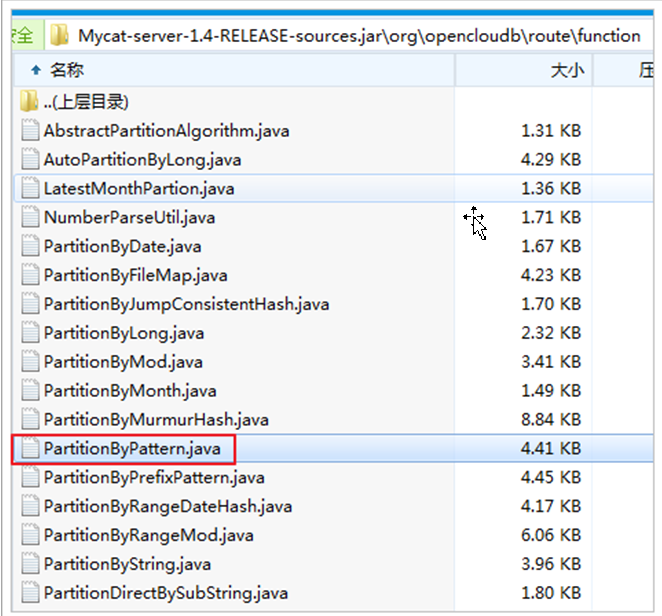

# MyCat

##  MyCat介绍

### 什么是MyCat？

简单的说，MyCat就是：

一个彻底开源的，面向企业应用开发的“大数据库集群”

支持事务、ACID、可以替代Mysql的加强版数据库

一个可以视为“Mysql”集群的企业级数据库，用来替代昂贵的Oracle集群

一个融合内存缓存技术、Nosql技术、HDFS大数据的新型SQL Server

结合传统数据库和新型分布式数据仓库的新一代企业级数据库产品

一个新颖的数据库中间件产品

MyCat的目标是：低成本的将现有的单机数据库和应用平滑迁移到“云”端，解决数据存储和业务规模迅速增长情况下的数据瓶颈问题。

##  MyCat的关键特性

支持 SQL 92标准

支持Mysql集群，可以作为Proxy使用

支持JDBC连接ORACLE、DB2、SQL Server，将其模拟为MySQL  Server使用

支持galera for mysql集群，percona-cluster或者mariadb cluster，提供高可用性数据分片集群

自动故障切换，高可用性

支持读写分离，支持Mysql双主多从，以及一主多从的模式

支持全局表，数据自动分片到多个节点，用于高效表关联查询

支持独有的基于E-R 关系的分片策略，实现了高效的表关联查询

多平台支持，部署和实施简单

## MyCat架构

如图所示：MyCat使用Mysql的通讯协议模拟成了一个Mysql服务器，并建立了完整的Schema（数据库）、Table （数据表）、User(用户)的逻辑模型，并将这套逻辑模型映射到后端的存储节点DataNode（MySQL Instance）上的真实物理库中，这样一来，所有能使用Mysql的客户端以及编程语言都能将MyCat当成是Mysql Server来使用，不必开发新的客户端协议。

## Mycat对多数据库的支持

## 下载MyCat

官方网站：

[http://www.MyCat.org.cn/](http://www.mycat.org.cn/)

 

github地址

[https://github.com/MyCatApache](https://github.com/MyCATApache)

## 环境准备

数据库准备,准备三个MySQL数据库。

在Linux上安装一个MySQL数据库进行模拟，在设置三个数据库，作为集群中的库进行使用。

Linux安装MySQL百度查看

## 集群分片规则

##  MyCat安装

### 1.上传到服务器

### 2.移动并解压MyCat

[root@itcast-01 ~]# mv MyCat-server-1.4-RELEASE-20150901112004-linux.tar.gz/usr/local/

[root@itcast-01 ~]# cd /usr/local/

[root@itcast-01 local]# tar -zxf MyCat-server-1.4-RELEASE-20150901112004-linux.tar.gz

### 3.配置MyCat

[root@itcast-01 local]# cd MyCat/

[root@itcast-01 MyCat]# cd conf/

#### 3.1 配置server.xml

[root@itcast-01 conf]# vim server.xml

#### 3.2 配置schema.xml

[root@itcast-01 conf]# vim schema.xml

#### 3.3 配置rule.xml

[root@itcast-01 conf]# vim rule.xml

#### 3.4  查找分片算法

配置的分片规则算法，可以参考以下源码：

下面是压缩包中分片规则的算法，我们使用的是求余的方式：

org.opencloudb.route.function.PartitionByPattern

#### 3.5 配置分片算法

根据分配片的java代码，继续在rule.xml配置分片算法

按下图方式配置分片规则算法：

#### 3.6 添加并编辑配置文件

[root@itcast-01 conf]# vim auto-id.txt

0-127=0

128-255=1

255-511=2

## 启动MyCat

[root@itcast-01 conf]# cd /usr/local/MyCat/bin/

[root@itcast-01 bin]# ./MyCat start

## MyCat测试

连接MyCat：

连接MyCat和链接MySQL是一样的，区别是，MyCat的端口号是8066

MyCat的账号密码在server.xml中进行配置

 

测试MyCat：

在MyCat中创建数据库表，发现使用的三个库都创建了表

在MyCat中插入数据，发现按照规则给三个数据库分别插入了数据

