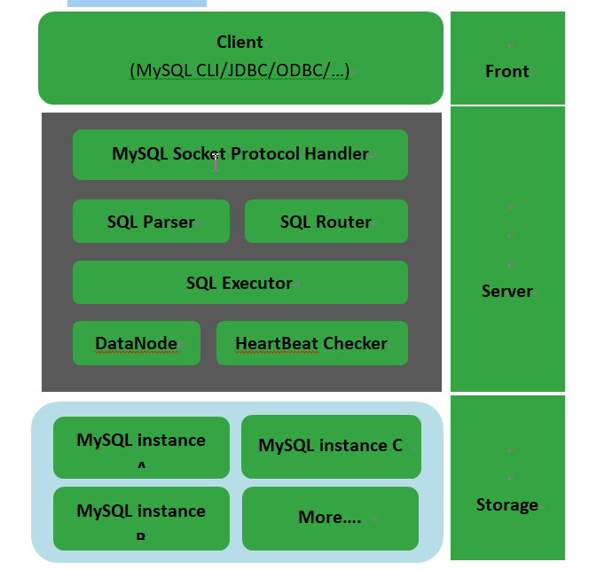
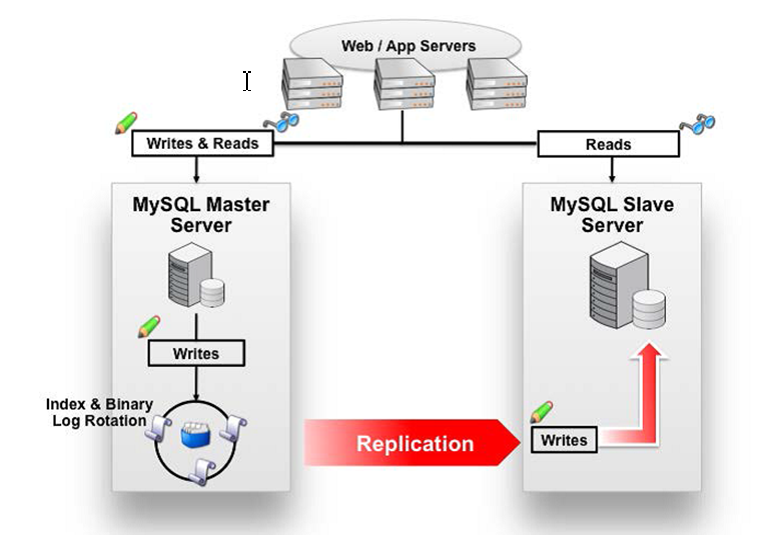

# MyCat02

## MyCAT介绍

### 什么是MyCAT？

简单的说，MyCAT就是：

一个彻底开源的，面向企业应用开发的“大数据库集群”

支持事务、ACID、可以替代Mysql的加强版数据库

一个可以视为“Mysql”集群的企业级数据库，用来替代昂贵的Oracle集群

一个融合内存缓存技术、Nosql技术、HDFS大数据的新型SQL Server

结合传统数据库和新型分布式数据仓库的新一代企业级数据库产品

一个新颖的数据库中间件产品

MyCAT的目标是：低成本的将现有的单机数据库和应用平滑迁移到“云”端，解决数据存储和业务规模迅速增长情况下的数据瓶颈问题。

## MyCAT的关键特性

支持 SQL 92标准

支持Mysql集群，可以作为Proxy使用

支持JDBC连接ORACLE、DB2、SQL Server，将其模拟为MySQL  Server使用

支持galera formysql集群，percona-cluster或者mariadb cluster，提供高可用性数据分片集群

自动故障切换，高可用性

支持读写分离，支持Mysql双主多从，以及一主多从的模式

支持全局表，数据自动分片到多个节点，用于高效表关联查询

支持独有的基于E-R 关系的分片策略，实现了高效的表关联查询

多平台支持，部署和实施简单

## MyCAT架构



如图所示：MyCAT使用Mysql的通讯协议模拟成了一个Mysql服务器，并建立了完整的Schema（数据库）、Table （数据表）、User(用户)的逻辑模型，并将这套逻辑模型映射到后端的存储节点DataNode（MySQL Instance）上的真实物理库中，这样一来，所有能使用Mysql的客户端以及编程语言都能将MyCAT当成是Mysql Server来使用，不必开发新的客户端协议。

##  Mycat解决的问题

l  性能问题

l  数据库连接过多

l  E-R分片难处理

l  可用性问题

l  成本和伸缩性问题


## Mycat对多数据库的支持


## 分片策略 

MyCAT支持水平分片与垂直分片：

水平分片：一个表格的数据分割到多个节点上，按照行分隔。

垂直分片：一个数据库中多个表格A，B，C，A存储到节点1上，B存储到节点2上，C存储到节点3上。


MyCAT通过定义表的分片规则来实现分片，每个表格可以捆绑一个分片规则，每个分片规则指定一个分片字段并绑定一个函数，来实现动态分片算法。

 

1、**Schema**：逻辑库，与MySQL中的Database（数据库）对应，一个逻辑库中定义了所包括的Table。

2、**Table**：表，即物理数据库中存储的某一张表，与传统数据库不同，这里的表格需要声明其所存储的逻辑数据节点DataNode。**在此可以指定表的分片规则。**

3、**DataNode**：MyCAT的逻辑数据节点，是存放table的具体物理节点，也称之为分片节点，通过DataSource来关联到后端某个具体数据库上

4、**DataSource**：定义某个物理库的访问地址，用于捆绑到Datanode上

## Mycat的下载及安装

官方网站：

<http://www.mycat.org.cn/>

 

github地址

<https://github.com/MyCATApache>


第一步：把MyCat的压缩包上传到linux服务器

第二步：解压缩，得到mycat目录

第三步：进入mycat/bin，启动MyCat

启动命令：./mycatstart

停止命令：./mycatstop

重启命令：./mycatrestart


注意：可以使用mysql的客户端直接连接mycat服务。默认服务端口为8066

## Mycat分片

### 配置schema.xml

#### Schema.xml介绍

Schema.xml作为MyCat中重要的配置文件之一，管理着MyCat的逻辑库、表、分片规则、DataNode以及DataSource。弄懂这些配置，是正确使用MyCat的前提。这里就一层层对该文件进行解析。

 

schema 标签用于定义MyCat实例中的逻辑库

Table 标签定义了MyCat中的逻辑表

dataNode 标签定义了MyCat中的数据节点，也就是我们通常说所的数据分片。

dataHost标签在mycat逻辑库中也是作为最底层的标签存在，直接定义了具体的数据库实例、读写分离配置和心跳语句。


注意：若是LINUX版本的MYSQL，则需要设置为Mysql大小写不敏感，否则可能会发生表找不到的问题。

在MySQL的配置文件中my.ini [mysqld] 中增加一行　

lower_case_table_names = 1

### Schema.xml配置

```xml 
<?xml version="1.0"?>
<!DOCTYPE mycat:schema SYSTEM "schema.dtd">
<mycat:schema xmlns:mycat="http://org.opencloudb/">

	<schema name="TESTDB" checkSQLschema="false" sqlMaxLimit="100">
		<!-- auto sharding by id (long) -->
		<table name="TB_ITEM" dataNode="dn1,dn2,dn3" rule="auto-sharding-long" />
		<table name="TB_USER" primaryKey="ID" type="global" dataNode="dn1,dn2" />
	</schema>
	<dataNode name="dn1" dataHost="localhost1" database="db1" />
	<dataNode name="dn2" dataHost="localhost2" database="db2" />
	<dataNode name="dn3" dataHost="localhost1" database="db3" />
	<dataHost name="localhost1" maxCon="1000" minCon="10" balance="0"
		writeType="0" dbType="mysql" dbDriver="native" switchType="1"  slaveThreshold="100">
		<heartbeat>select user()</heartbeat>
		<!-- can have multi write hosts -->
		<writeHost host="hostM1" url="192.168.25.134:3306" user="root"
			password="root">
			<!-- can have multi read hosts -->

		</writeHost>
	</dataHost>
	<dataHost name="localhost2" maxCon="1000" minCon="10" balance="0"
		writeType="0" dbType="mysql" dbDriver="native" switchType="1"  slaveThreshold="100">
		<heartbeat>select user()</heartbeat>
		<!-- can have multi write hosts -->
		<writeHost host="hostM1" url="192.168.25.166:3306" user="root"
			password="root">
			<!-- can have multi read hosts -->
		</writeHost>
	</dataHost>
</mycat:schema>

```

## 配置server.xml

 

### Server.xml介绍

server.xml几乎保存了所有mycat需要的系统配置信息。最常用的是在此配置用户名、密码及权限。

 

### Server.xml配置

```
<user name="test">
    <property name="password">test</property>
    <property name="schemas">TESTDB</property>
    <property name="readOnly">true</property>
</user>

```

##  配置rule.xml

rule.xml里面就定义了我们对表进行拆分所涉及到的规则定义。我们可以灵活的对表使用不同的分片算法，或者对表使用相同的算法但具体的参数不同。这个文件里面主要有tableRule和function这两个标签。在具体使用过程中可以按照需求添加tableRule

和function。

此配置文件可以不用修改，使用默认即可。

##  分片测试

由于配置的分片规则为“auto-sharding-long”，所以mycat会根据此规则自动分片。

每个datanode中保存一定数量的数据。根据id进行分片

经测试id范围为：

Datanode1：1~5000000

Datanode2：5000000~10000000

Datanode3：10000001~15000000

 

当15000000以上的id插入时报错：

[Err] 1064 - can't find any valid datanode:TB_ITEM -> ID -> 15000001

此时需要添加节点了。

## Mycat读写分离

数据库读写分离对于大型系统或者访问量很高的互联网应用来说，是必不可少的一个重要功能。对于MySQL来说，标准的读写分离是主从模式，一个写节点Master后面跟着多个读节点，读节点的数量取决于系统的压力，通常是1-3个读节点的配置


Mycat读写分离和自动切换机制，需要mysql的主从复制机制配合。

##  Mysql的主从复制



主从配置需要注意的地方

1、主DB server和从DB server数据库的版本一致

2、主DB server和从DB server数据库数据一致[ 这里就会可以把主的备份在从上还原，也可以直接将主的数据目录拷贝到从的相应数据目录]

3、主DB server开启二进制日志,主DB server和从DB server的server_id都必须唯一

## Mysql主服务器配置

第一步：修改my.conf文件：

在[mysqld]段下添加：

```
binlog-do-db=db1
binlog-ignore-db=mysql
#启用二进制日志
log-bin=mysql-bin
#服务器唯一ID，一般取IP最后一段
server-id=134

```

第二步：重启mysql服务

service mysqld restart

第三步：建立帐户并授权slave

mysql>GRANT FILE ON *.* TO 'backup'@'%'IDENTIFIED BY '123456';

mysql>GRANT REPLICATION SLAVE,REPLICATION CLIENT ON *.* to 'backup'@'%' identified by '123456'; 

\#一般不用root帐号，“%”表示所有客户端都可能连，只要帐号，密码正确，此处可用具体客户端IP代替，如192.168.145.226，加强安全。

 

刷新权限

mysql> FLUSH PRIVILEGES;

  

查看mysql现在有哪些用户

mysql>select user,host from mysql.user;

 

第四步：查询master的状态

mysql> show master status;

+------------------+----------+--------------+------------------+-------------------+

| File             | Position | Binlog_Do_DB |Binlog_Ignore_DB | Executed_Gtid_Set |

+------------------+----------+--------------+------------------+-------------------+

| mysql-bin.000001 |      120 | db1          | mysql            |                   |

+------------------+----------+--------------+------------------+-------------------+

1
row in set

## Mysql从服务器配置

第一步：修改my.conf文件

[mysqld]

server-id=166

 

第二步：配置从服务器

mysql>change master to master_host='192.168.25.134',master_port=3306,master_user='backup',master_password='123456',master_log_file='mysql-bin.000001',master_log_pos=120

 

注意语句中间不要断开，master_port为mysql服务器端口号(无引号)，master_user为执行同步操作的数据库账户，“120”无单引号(此处的120就是show masterstatus 中看到的position的值，这里的mysql-bin.000001就是file对应的值)。

 

第二步：启动从服务器复制功能

Mysql>start slave; 

 

第三步：检查从服务器复制功能状态：

mysql> show slave status

 

……………………(省略部分)

Slave_IO_Running: Yes //此状态必须YES

Slave_SQL_Running: Yes //此状态必须YES

……………………(省略部分)

注：Slave_IO及Slave_SQL进程必须正常运行，即YES状态，否则都是错误的状态(如：其中一个NO均属错误)。

 

| 错误处理：  如果出现此错误：  Fatal error: The slave I/O thread stops  because master and slave have equal MySQL server UUIDs; these UUIDs must be  different for replication to work.  因为是mysql是克隆的系统所以mysql的uuid是一样的，所以需要修改。 |
| ---------------------------------------- |
| 解决方法：  删除/var/lib/mysql/auto.cnf文件，重新启动服务。 |


##  Mycat配置

Mycat 1.4 支持MySQL主从复制状态绑定的读写分离机制，让读更加安全可靠，配置如下：

```
<dataNode name="dn1" dataHost="localhost1" database="db1" />
	<dataNode name="dn2" dataHost="localhost1" database="db2" />
	<dataNode name="dn3" dataHost="localhost1" database="db3" />
	<dataHost name="localhost1" maxCon="1000" minCon="10" balance="1"
		writeType="0" dbType="mysql" dbDriver="native" switchType="2"  slaveThreshold="100">
		<heartbeat>show slave status</heartbeat>
		<writeHost host="hostM" url="192.168.25.134:3306" user="root"
			password="root">
			<readHost host="hostS" url="192.168.25.166:3306" user="root"
			password="root" />
		</writeHost>
	</dataHost>


```

**(1)****设置 balance="1"与writeType="0"**

Balance参数设置：

\1. balance=“0”, 所有读操作都发送到当前可用的writeHost上。

\2. balance=“1”，所有读操作都随机的发送到readHost。

\3. balance=“2”，所有读操作都随机的在writeHost、readhost上分发

WriteType参数设置：

1.writeType=“0”, 所有写操作都发送到可用的writeHost上。

\2. writeType=“1”，所有写操作都随机的发送到readHost。

\3. writeType=“2”，所有写操作都随机的在writeHost、readhost分上发。

 “readHost是从属于writeHost的，即意味着它从那个writeHost获取同步数据，因此，当它所属的writeHost宕机了，则它也不会再参与到读写分离中来，即“不工作了”，这是因为此时，它的数据已经“不可靠”了。基于这个考虑，目前mycat 1.3和1.4版本中，若想支持MySQL一主一从的标准配置，并且在主节点宕机的情况下，从节点还能读取数据，则需要在Mycat里配置为两个writeHost并设置banlance=1。”

**(1)****设置 switchType="2"与slaveThreshold="100"**

**switchType ****目前有三种选择：**

**-1****：表示不自动切换**

**1 ****：默认值，自动切换**

**2 ****：基于MySQL主从同步的状态决定是否切换**

“Mycat心跳检查语句配置为 show slave status ，dataHost 上定义两个新属性： switchType="2" 与slaveThreshold="100"，此时意味着开启MySQL主从复制状态绑定的读写分离与切换机制。Mycat心跳机制通过检测 show slave status 中的 "Seconds_Behind_Master", "Slave_IO_Running","Slave_SQL_Running" 三个字段来确定当前主从同步的状态以及Seconds_Behind_Master主从复制时延。“