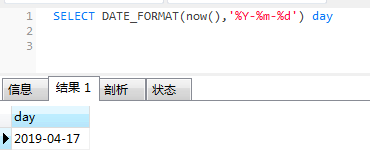

# DATE_FORMAT() 

##### 功能：函数用于以不同的格式显示日期/时间数据。

##### 语法：

```mysql
DATE_FORMAT(date,format)
```

date 参数是合法的日期。format规定日期/时间的输出格式。

##### 例子：

```mysql
SELECT DATE_FORMAT(now(),'%Y-%m-%d') day
```




```mysql
SELECT DATE_FORMAT(NOW(),   '%Y-%m-%d %H:%i:%S');

2017-04-05 16:53:59（String型格式）
```


[[FROM_UNIXTIME 格式化MYSQL时间戳函数](https://www.cnblogs.com/xieqian111/p/5735952.html)](https://www.cnblogs.com/xieqian111/p/5735952.html)

