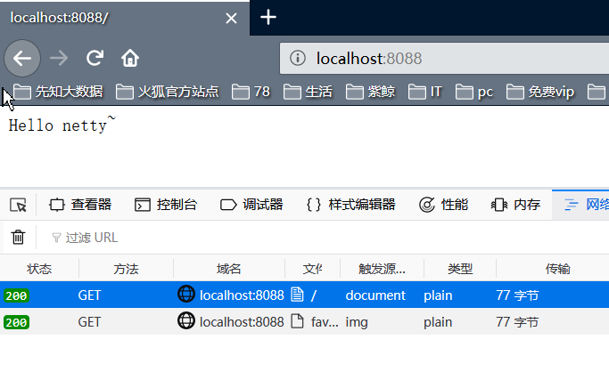
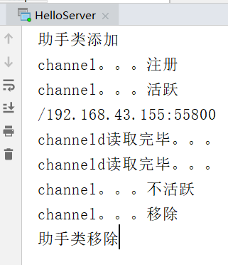

# netty-hello

## 一、Hello netty

### 1.Maven坐标

```pom
<dependencies>
		<dependency>
			<groupId>io.netty</groupId>
			<artifactId>netty-all</artifactId>
			<version>4.1.25.Final</version>
		</dependency>
</dependencies>
```

### 2.创建netty服务器

```java
import io.netty.bootstrap.ServerBootstrap;
import io.netty.channel.Channel;
import io.netty.channel.ChannelFuture;
import io.netty.channel.EventLoopGroup;
import io.netty.channel.nio.NioEventLoopGroup;
import io.netty.channel.socket.nio.NioServerSocketChannel;

/**
 * @Description: 实现客户端发送一个请求，服务器会返回 hello netty
 */
public class HelloServer {

	public static void main(String[] args) throws Exception {

		// 定义一对线程组
		// 主线程组, 用于接受客户端的连接，但是不做任何处理，跟老板一样，不做事
		EventLoopGroup bossGroup = new NioEventLoopGroup();
		// 从线程组, 老板线程组会把任务丢给他，让手下线程组去做任务
		EventLoopGroup workerGroup = new NioEventLoopGroup();
		
		try {
			// netty服务器的创建, ServerBootstrap 是一个启动类
			ServerBootstrap serverBootstrap = new ServerBootstrap();
			serverBootstrap.group(bossGroup, workerGroup)			// 设置主从线程组
							.channel(NioServerSocketChannel.class)	// 设置nio的双向通道
							.childHandler(new HelloServerInitializer()); // 子处理器，用于处理workerGroup
			
			// 启动server，并且设置8088为启动的端口号，同时启动方式为同步
			ChannelFuture channelFuture = serverBootstrap.bind(8088).sync();
			
			// 监听关闭的channel，设置位同步方式
			channelFuture.channel().closeFuture().sync();
		} finally {
			bossGroup.shutdownGracefully();
			workerGroup.shutdownGracefully();
		}
	}

}
```

### 3.创建一个初始化器

```java
import io.netty.channel.ChannelInitializer;
import io.netty.channel.ChannelPipeline;
import io.netty.channel.socket.SocketChannel;
import io.netty.handler.codec.http.HttpServerCodec;

/**
 * @Description: 初始化器，channel注册后，会执行里面的相应的初始化方法
 */
public class HelloServerInitializer extends ChannelInitializer<SocketChannel> {

	@Override
	protected void initChannel(SocketChannel channel) throws Exception {
		// 通过SocketChannel去获得对应的管道
		ChannelPipeline pipeline = channel.pipeline();
		
		// 通过管道，添加handler
		// HttpServerCodec是由netty自己提供的助手类，可以理解为拦截器
		// 当请求到服务端，我们需要做解码，响应到客户端做编码
		pipeline.addLast("HttpServerCodec", new HttpServerCodec());
		
		// 添加自定义的助手类，返回 "hello netty~"
		pipeline.addLast("customHandler", new CustomHandler());
	}

}
```

### 4.创建自定义助手类

```java
import io.netty.buffer.ByteBuf;
import io.netty.buffer.Unpooled;
import io.netty.channel.Channel;
import io.netty.channel.ChannelHandlerContext;
import io.netty.channel.SimpleChannelInboundHandler;
import io.netty.handler.codec.http.DefaultFullHttpResponse;
import io.netty.handler.codec.http.FullHttpResponse;
import io.netty.handler.codec.http.HttpHeaderNames;
import io.netty.handler.codec.http.HttpObject;
import io.netty.handler.codec.http.HttpRequest;
import io.netty.handler.codec.http.HttpResponseStatus;
import io.netty.handler.codec.http.HttpVersion;
import io.netty.util.CharsetUtil;

/**
 * @Description: 创建自定义助手类
 */
// SimpleChannelInboundHandler: 对于请求来讲，其实相当于[入站，入境]
public class CustomHandler extends SimpleChannelInboundHandler<HttpObject> {

	@Override
	protected void channelRead0(ChannelHandlerContext ctx, HttpObject msg) 
			throws Exception {
		// 获取channel
		Channel channel = ctx.channel();
		
		if (msg instanceof HttpRequest) {
			// 显示客户端的远程地址
			System.out.println(channel.remoteAddress());
			
			// 定义发送的数据消息
			ByteBuf content = Unpooled.copiedBuffer("Hello netty~", CharsetUtil.UTF_8);
			
			// 构建一个http response
			FullHttpResponse response = 
					new DefaultFullHttpResponse(HttpVersion.HTTP_1_1, 
							HttpResponseStatus.OK, 
							content);
			// 为响应增加数据类型和长度
			response.headers().set(HttpHeaderNames.CONTENT_TYPE, "text/plain");
			response.headers().set(HttpHeaderNames.CONTENT_LENGTH, content.readableBytes());
			
			// 把响应刷到客户端
			ctx.writeAndFlush(response);
		}
		
	}

	@Override
	public void channelRegistered(ChannelHandlerContext ctx) throws Exception {
		System.out.println("channel。。。注册");
		super.channelRegistered(ctx);
	}

	@Override
	public void channelUnregistered(ChannelHandlerContext ctx) throws Exception {
		System.out.println("channel。。。移除");
		super.channelUnregistered(ctx);
	}

	@Override
	public void channelActive(ChannelHandlerContext ctx) throws Exception {
		System.out.println("channel。。。活跃");
		super.channelActive(ctx);
	}

	@Override
	public void channelInactive(ChannelHandlerContext ctx) throws Exception {
		System.out.println("channel。。。不活跃");
		super.channelInactive(ctx);
	}

	@Override
	public void channelReadComplete(ChannelHandlerContext ctx) throws Exception {
		System.out.println("channeld读取完毕。。。");
		super.channelReadComplete(ctx);
	}

	@Override
	public void userEventTriggered(ChannelHandlerContext ctx, Object evt) throws Exception {
		System.out.println("用户事件触发。。。");
		super.userEventTriggered(ctx, evt);
	}

	@Override
	public void channelWritabilityChanged(ChannelHandlerContext ctx) throws Exception {
		System.out.println("channel可写更改");
		super.channelWritabilityChanged(ctx);
	}

	@Override
	public void exceptionCaught(ChannelHandlerContext ctx, Throwable cause) throws Exception {
		System.out.println("补货到异常");
		super.exceptionCaught(ctx, cause);
	}

	@Override
	public void handlerAdded(ChannelHandlerContext ctx) throws Exception {
		System.out.println("助手类添加");
		super.handlerAdded(ctx);
	}

	@Override
	public void handlerRemoved(ChannelHandlerContext ctx) throws Exception {
		System.out.println("助手类移除");
		super.handlerRemoved(ctx);
	}

}
```

### 5.浏览器访问及效果




### 6.curl访问的效果




