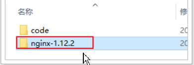
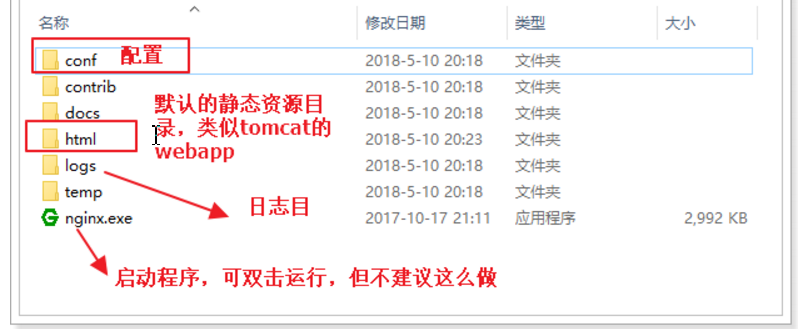

# nginx解决端口问题

### 1.4.1.什么是Nginx


NIO：not-blocking-io 非阻塞IO

BIO：blocking-IO 阻塞IO

nginx可以作为web服务器，但更多的时候，我们把它作为网关，因为它具备网关必备的功能：

- 反向代理
- 负载均衡
- 动态路由
- 请求过滤

### 1.4.2.nginx作为web服务器

Web服务器分2类：

- web应用服务器，如：
  - tomcat
  - resin
  - jetty

- web服务器，如：
  - Apache 服务器
  - Nginx
  - IIS

区分：web服务器不能解析jsp等页面，只能处理js、css、html等静态资源。
并发：web服务器的并发能力远高于web应用服务器。

Nginx + tomcat

### 1.4.3.nginx作为反向代理

什么是反向代理？

- 代理：通过客户机的配置，实现让一台服务器代理客户机，客户的所有请求都交给代理服务器处理。
- 反向代理：用一台服务器，代理真实服务器，用户访问时，不再是访问真实服务器，而是代理服务器。

nginx可以当做反向代理服务器来使用：

- 我们需要提前在nginx中配置好反向代理的规则，不同的请求，交给不同的真实服务器处理
- 当请求到达nginx，nginx会根据已经定义的规则进行请求的转发，从而实现路由功能


利用反向代理，就可以解决我们前面所说的端口问题，如图


### 1.4.4.安装和使用

> ### 安装

安装非常简单，nginx安装包直接解压即可，绿色免安装，舒服！

 

安装一台nginx：

 

目录结构：

 


> ### 使用

nginx可以通过命令行来启动，操作命令：

- 启动：`start nginx.exe`
- 停止：`nginx.exe -s stop`
- 重新加载：`nginx.exe -s reload`


> ### 反向代理配置

示例：

 

nginx中的每个server就是一个反向代理配置，可以有多个server


完整配置：

```nginx

#user  nobody;
worker_processes  1;

events {
    worker_connections  1024;
}

http {
    include       mime.types;
    default_type  application/octet-stream;
    sendfile        on;
   
    keepalive_timeout  65;

    gzip  on;
	server {
        listen       80;
        server_name  manage.leyou.com;

        proxy_set_header X-Forwarded-Host $host;
        proxy_set_header X-Forwarded-Server $host;
        proxy_set_header X-Forwarded-For $proxy_add_x_forwarded_for;

        location / {
			proxy_pass http://127.0.0.1:9001;
			proxy_connect_timeout 600;
			proxy_read_timeout 600;
        }
    }
	server {
        listen       80;
        server_name  api.leyou.com;

        proxy_set_header X-Forwarded-Host $host;
        proxy_set_header X-Forwarded-Server $host;
        proxy_set_header X-Forwarded-For $proxy_add_x_forwarded_for;

        location / {
			proxy_pass http://127.0.0.1:10010;
			proxy_connect_timeout 600;
			proxy_read_timeout 600;
        }
    }
}
```


## 1.5.测试

启动nginx，然后就可以用域名访问


现在实现了域名访问网站了，中间的流程是怎样的呢？


1. 浏览器准备发起请求，访问http://mamage.leyou.com，但需要进行域名解析

2. 优先进行本地域名解析，因为我们修改了hosts，所以解析成功，得到地址：127.0.0.1

3. 请求被发往解析得到的ip，并且默认使用80端口：http://127.0.0.1:80

   本机的nginx一直监听80端口，因此捕获这个请求

4. nginx中配置了反向代理规则，将manage.leyou.com代理到127.0.0.1:9001，因此请求被转发

5. 后台系统的webpack server监听的端口是9001，得到请求并处理，完成后将响应返回到nginx

6. nginx将得到的结果返回到浏览器


