# SVN集中式版本控制

## 1        开发中的实际问题

1.1        小明负责的模块就要完成了，就在即将Release之前的一瞬间，电脑突然蓝屏，硬盘光荣牺牲！几个月来的努力付之东流——需求之一：**备份**！

1.2        这个项目中需要一个很复杂的功能，老王摸索了一个星期终于有眉目了，可是这被改得面目全非的代码已经回不到从前了。什么地方能买到哆啦A梦的时光机啊？需求之二：**代码还原**！

1.3        小刚和小强先后从文件服务器上下载了同一个文件：Analysis.java。小刚在Analysis.java文件中的第30行声明了一个方法，叫count()，先保存到了文件服务器上；小强在Analysis.java文件中的第50行声明了一个方法，叫sum()，也随后保存到了文件服务器上，于是，count()方法就只存在于小刚的记忆中了——需求之三：**协同修改**！

1.4        老许是一位项目经理，我会告诉你他把每一个版本都保存一份吗？我会告诉你这些工程里其实有很多文件都是重复的吗？我会告诉你老许为这事删了很多电影吗？——需求之四：**多版本项目文件管理**！

1.5        老王是另一位项目经理，每次因为项目进度挨骂之后，他都不知道该扣哪个程序员的工资！就拿这次来说吧，有个该死的Bug调试了30多个小时才知道是因为相关属性没有在应用初始化时赋值！可是二胖、王东、刘流和正经牛都不承认是自己干的！——需求之五：**追溯问题代码的编写人和编写时间**！

1.6        小温这两天幸福的如同掉进了蜜罐里，因为他成功的得到了前台MM丽丽的芳心，可他郁闷的是这几天总是收到QA小组的邮件，要求他修正程序中存在的Bug，可他自己本地电脑上是没有这些Bug的，“难道我的代码被哪个孙子给改了？”。是的，小温没来的时候，丽丽是QA小组小郑的女朋友啊！——需求之六：**权限控制**！

## 2 版本控制简介

2.1        **版本控制**[Revision control]，最初来源于工程设计领域，是维护工程蓝图的标准做法，能追踪工程蓝图从诞生一直到定案的过程。是一种记录若干文件内容变化，以便将来查阅特定版本修订情况的系统。

2.2        Subversion就是一款实现版本控制的工具软件，通常也称为版本控制器，简称SVN。Subversion是Apache软件基金会组织下的一个项目。

2.3        Subversion的优良特性

①目录版本控制

CVS只能追踪单个文件的历史，但是Subversion实现了一个“虚拟”文件系统，可以追踪整个目录树的修改，文件和目录都是版本控制的，结果就是可以在客户端对文件和目录执行移动和复制命令。

②原子提交

提交要么完全进入版本库，要么一点都没有，这允许开发者以一个逻辑块提交修改。

③版本控制的元数据

每个文件和目录都有一组附加的“属性”，你可以发明和保存任意的键/值对，属性也会像文件内容一样被纳入版本控制。

④可选的网络层

Subversion在版本库访问方面有一个抽象概念，利于人们去实现新的网络机制，Subversion的“高级”服务器是 Apache 网络服务器的一个模块，使用 HTTP 的变种协议 WebDAV/DeltaV 通讯，这给了 Subversion 在稳定性和交互性方面很大的好处，可以直接使用服务器的特性，例如认证、授权、传输压缩和版本库浏览等等。也有一个轻型的，单独运行的 Subversion 服务器，这个服务器使用自己的协议，可以轻松的用 SSH 封装。

⑤一致的数据处理

Subversion使用二进制文件差异算法展现文件的区别，对于文本(人类可读)和二进制(人类不可读)文件具备一致的操作方式，两种类型的文件都压缩存放在版本库中，差异在网络上双向传递。

⑥高效的分支和标签

分支与标签的代价不与工程的大小成比例，Subversion建立分支与标签时只是复制项目，使用了一种类似于硬链接的机制，因而这类操作通常只会花费很少并且相对固定的时间，以及很小的版本库空间。

2.4        SVN的工作原理：采取**客户端****/服务器**模式——在服务器的版本库中保存项目文件的各个版本，所有参与协同开发的程序员在自己本地电脑上保存一个工作副本。SVN支持程序员将本地副本更新到服务器端的最新版本，也支持将本地副本的最新改变更新到服务器端，而且后面的更新不会覆盖前面的更新，而是作为一个新的版本被保存下来——SVN甚至支持将本地工作副本恢复为服务器端保存的某一个历史版本。

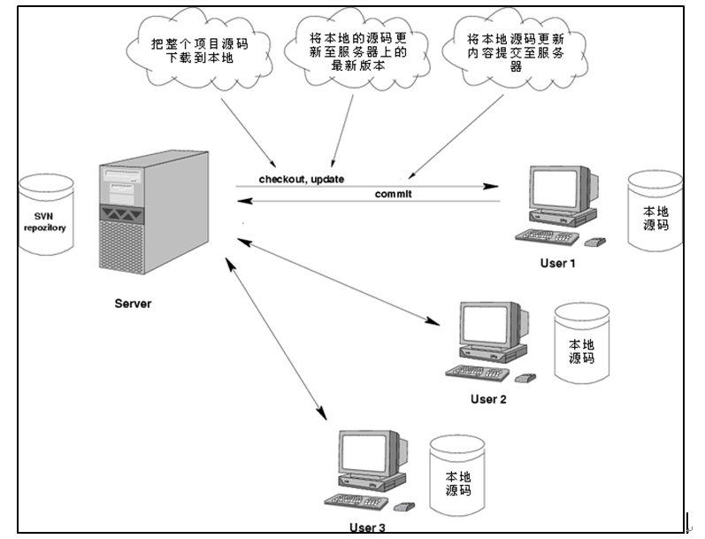

2.5    SVN基本操作

①**检出**（checkout）：将一个服务器端创建好的项目整个下载到本地，这是到项目组后参与开发的第一步，只需执行一次。

②**更新**（update）：将本地文件更新为服务器端的最新版本，通常为每天上班时或修改公共文件之前执行一次。

③**提交**（commit）：将本地修改提交到服务器端。通常每天下班前或每实现一个功能、完成一个模块时执行一次。

## 3 Subversion安装与配置

1.1        安装服务器端程序

①服务器端程序版本

目前Subversion的最新版本是 1.9.0-alpha2，这是一个测试版。官方网站推荐使用的版本是1.8.9，原话是：The best available version of Apache Subversionis: 1.8.9

②下载源码包

Apache组织自己维护更新的只是Subversion的源码，各个版本的源码包的下载地址是：http://subversion.apache.org/download/

Subversion源码是使用C语言开发的。

③下载二进制安装包

Subversion在不同平台下的二进制包是由不同组织构建实现的，Windows平台下的二进制包实现情况如下：

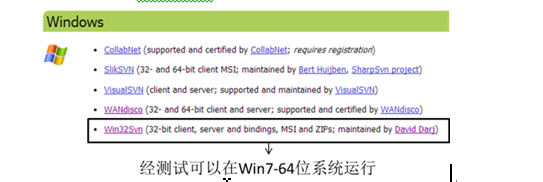

所以，服务器端程序的下载地址可以使用：

http://sourceforge.net/projects/win32svn/files/latest/download

下载到的文件是：Setup-Subversion-1.8.9-1.msi

④双击运行Setup-Subversion-1.8.9-1.msi

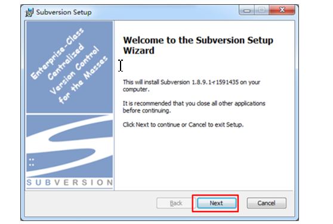

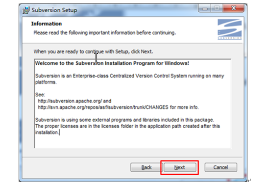

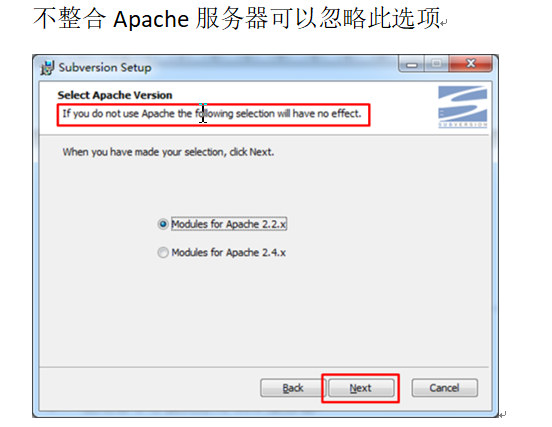

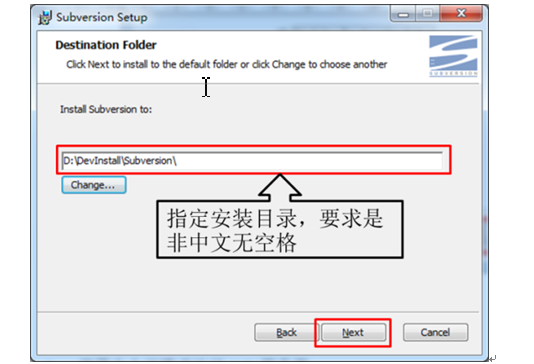

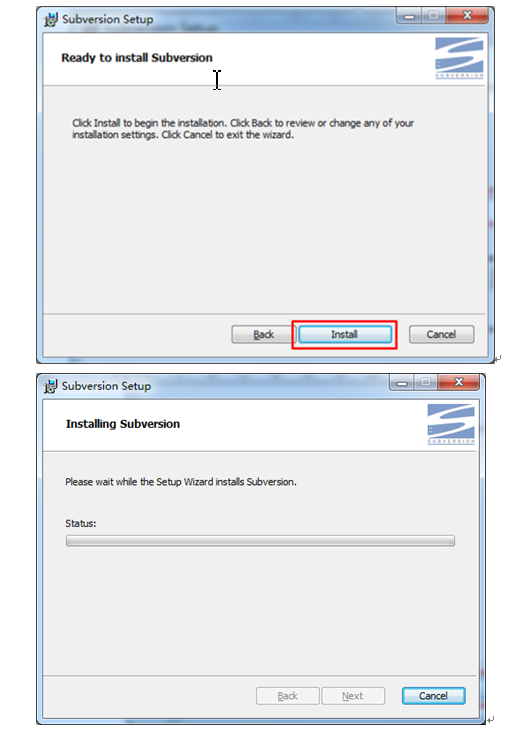

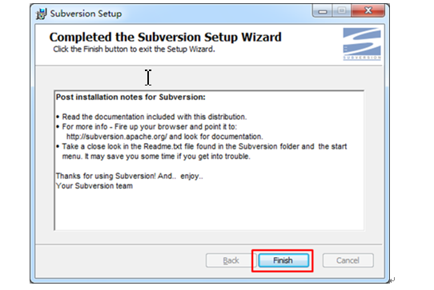

⑤安装程序会自动配置Path环境变量

D:\DevInstall\Subversion\bin

所以bin目录下的可执行文件可以在任意目录下运行。

⑥验证是否安装成功

在命令行输入：svn --version

看到如下信息就表示服务器端程序安装成功

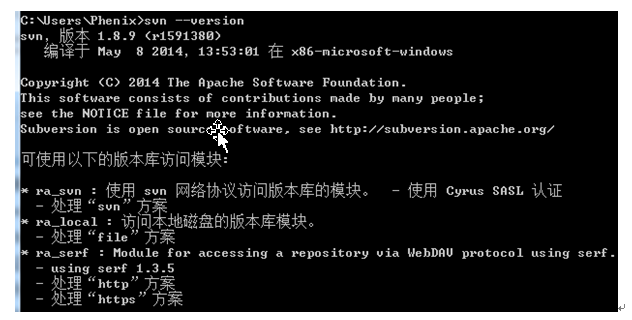

1.1        配置版本库

①为什么要配置版本库？

Subversion是将文件数据信息保存到版本库中进行管理的，为了满足用户的不同需求，Subversion允许用户对版本库目录进行定制。

②在一个非中文无空格目录下创建一个文件夹，作为版本库的根目录。

例如：D:\DevRepository\Subversion

③在版本库根目录下创建与具体项目对应的子目录——这样做的目的是使一个SVN服务器能够同时管理多个项目，而不是为每一个项目搭建一个SVN服务器——这显然太浪费资源了。

例如：D:\DevRepository\Subversion\CRM

​            D:\DevRepository\Subversion\ERP

​            D:\DevRepository\Subversion\OA

④创建版本库

命令格式

| 主命令      | 子命令                                      | 参数1  |
| -------- | ---------------------------------------- | ---- |
| svnadmin | create                                   | 仓库路径 |
| 举例       | svnadmin create  D:\DevRepository\Subversion\StuSys |      |

⑤版本库目录结构

版本库创建成功后会在指定目录下产生如下的目录结构

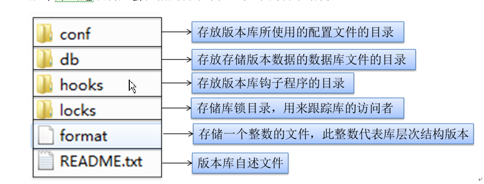

3. 3 启动服务器端程序

①SVN服务器必须处于运行状态才能响应客户端请求，帮助我们管理项目文件。所以我们必须将SVN服务器启动起来。启动SVN        服务器有两种方法，一个是命令行方式，一个是注册Windows服务。

②命令行方式

[1]命令格式

| 主命令      | 参数1                                      | 参数2        | 参数3                         |
| -------- | ---------------------------------------- | ---------- | --------------------------- |
| svnserve | -d表示后台执行                                 | -r表示版本库根目录 | D:\DevRepository\Subversion |
| 举例       | svnserve -d -r D:\DevRepository\Subversion |            |                             |

[2]验证服务是否启动

SVN服务监听3690端口，打开一个新的cmd窗口，使用netstat -an 命令查看3690端口是否被监听

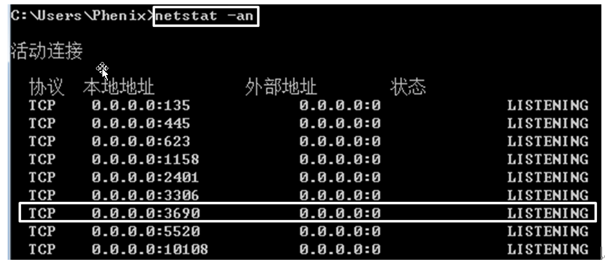

[3]命令行方式的缺陷是：只要运行服务器端程序的命令行窗口一关闭，服务就停止了，很不方便，而且每次开机都需要手动启动。

③注册Windows服务

[1]将SVN服务端程序注册为Windows服务，就可以让SVN服务随系统一起启动，克服了命令行方式的不足。

[2]注册Windows服务需要利用XP、2000以上系统自带工具Service Control，执行文件是sc.exe，注意这个命令不是SVN的命令。

[3]命令格式

| 主命令                                 | 子命令    | 参数1  | 参数2                                      | 参数3                 | 参数4                        |
| ----------------------------------- | ------ | ---- | ---------------------------------------- | ------------------- | -------------------------- |
| sc                                  | create | 服务名  | binpath= “运行服务所需要的二进制文件路径以及运行该二进制文件的命令行参数” | start= auto  表示自动启动 | depend= Tcpip  表示依赖Tcpip协议 |
| [**注意：在这个命令中，等号左边都没有空格，右边都有一个空格！**] |        |      |                                          |                     |                            |

[4]binpath组成结构说明

| svnserve.exe路径           | svnserve命令参数1                  | svnserve命令参数2 | svnserve命令参数3 |
| ------------------------ | ------------------------------ | ------------- | ------------- |
| SVN安装目录\bin\svnserve.exe | --service  表示以服务方式启动Subversion | -r  表示版本库根目录  | 版本库目录         |

[5]关于“版本库目录”

| 单仓库  | 指定与具体项目对应的仓库目录 | 例如：D:\DevRepository\Subversion\CRM | 只能为一个项目服务 |
| ---- | -------------- | ---------------------------------- | --------- |
| 多仓库  | 指定版本库的根目录      | 例如：D:\DevRepository\Subversion     | 可以为多个项目服务 |

[6]最终命令举例

●在Win7及以上系统中，运行该命令需要管理员权限，否则会得到如下错误提示

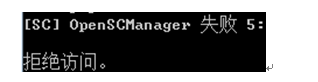

解决的办法是以管理员身份运行cmd命令行窗口即可

在防火墙或电脑卫士提示阻止时，选择允许

此时查看当前系统中的服务，可以看到我们刚刚创建的服务，但此时它还没有启动，如果创建失败，需检查sc命令是否正确

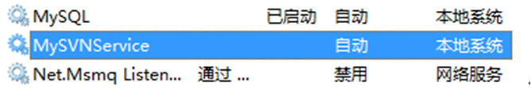

启动此服务

启动服务的命令格式如下：

| 格式   | sc start 服务名          |
| ---- | --------------------- |
| 举例   | sc start MySVNService |

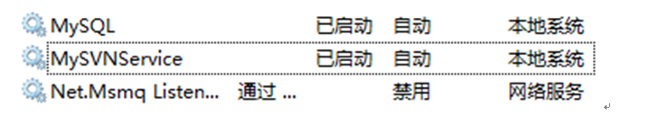

打开命令行窗口运行netstat –an查看3690端口是否被监听

●如果启动失败，那很有可能是binpath中的内容有错误，此时只能将已经创建的服务删除，重新创建。

●删除服务之前，最好先停止服务。停止服务的命令格式如下：

| 格式   | sc stop 服务名          |
| ---- | -------------------- |
| 举例   | sc stop MySVNService |

●删除服务的命令格式如下：

| 格式   | sc delete 服务名           |
| ---- | ----------------------- |
| 举例   | sc delete  MySVNService |

●删除、启动、停止服务同样需要管理员权限

## 4     使用命令行模式访问SVN服务器

1.1        检出

①首先进入自己的工作目录，例如：D:\DevWorkSpace\SVNSpace

②运行svn checkout命令，命令格式如下

| 格式   | svn checkout  svn://SVN服务器主机地址/具体仓库目录 保存检出内容的目录 |
| ---- | ---------------------------------------- |
| 举例   | svn checkout  svn://localhost/ERP MyERP  |
| 运行结果 | 取出版本 0。                                  |

③工作副本

运行checkout命令后进入MyERP目录，看到里面什么都没有。真的什么都没有吗？不是的。检出命令会在这一目录下创建一个隐藏目录.svn，用来保存与服务器交互的重要信息，其中包括从服务器端取回的最新版本信息、文件状态、更新时间等。SVN正是以此为依据判断当前目录中文件的状态。所以这个隐藏目录**千万不要删除或修改其中的内容**——完全无视它的存在吧。如果服务器端保存的文件可以视为一个“正本”，那么每个开发人员检出到本地目录的文件可以视为“副本”，通常称为工作副本。

1.2        提交

①进入D:\DevWorkSpace\SVNSpace\MyERP目录

②创建一个文件test.txt

③执行svn commit命令，运行结果是